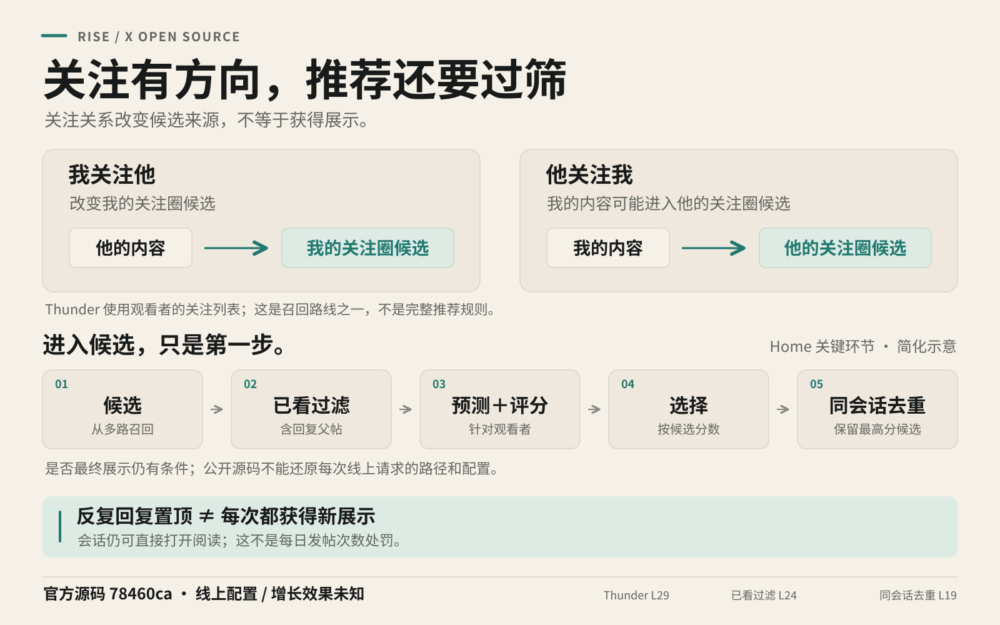
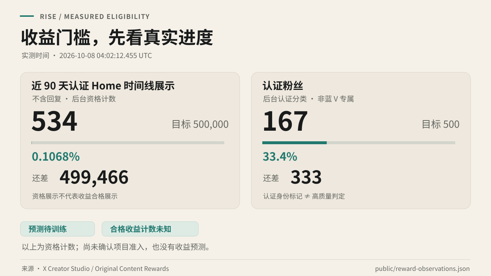
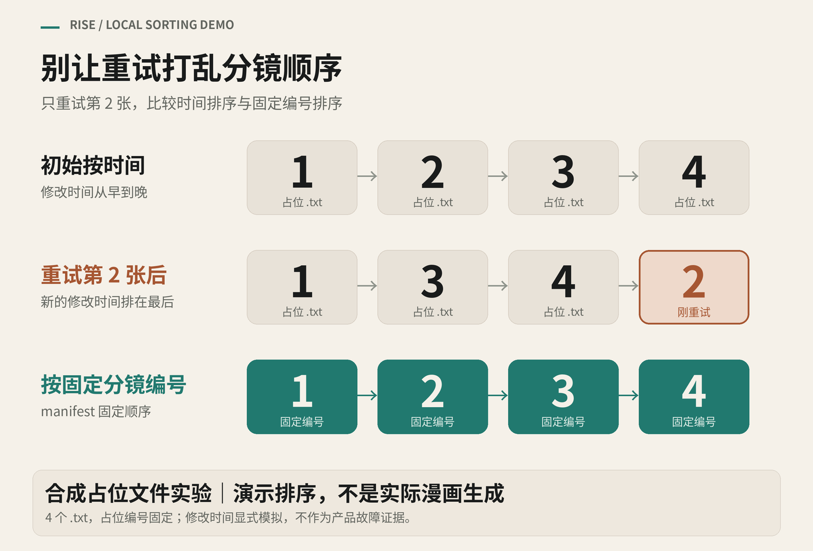
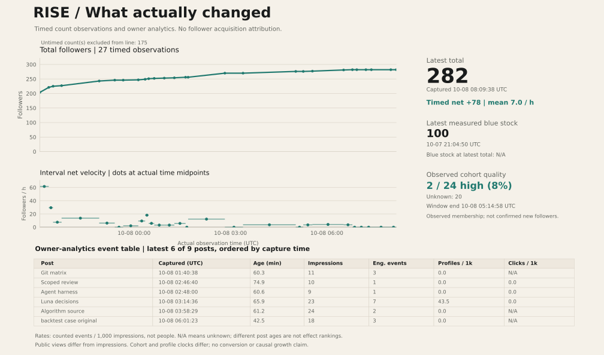
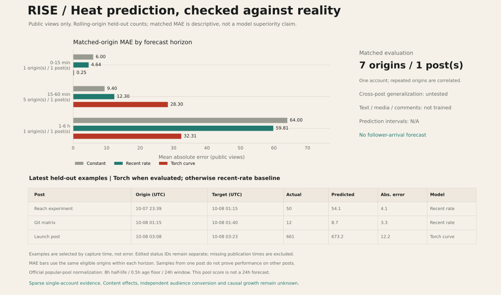
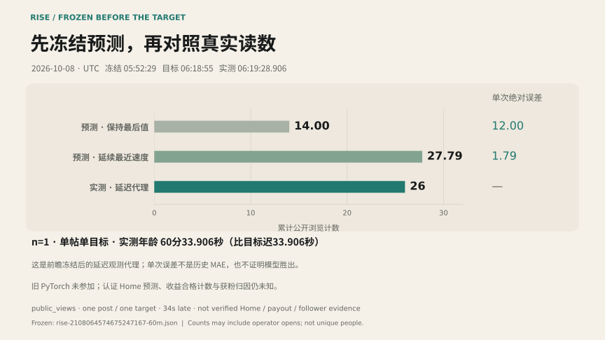
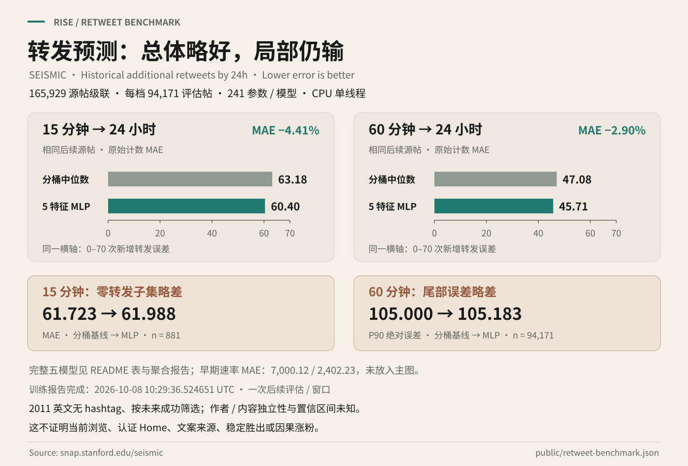
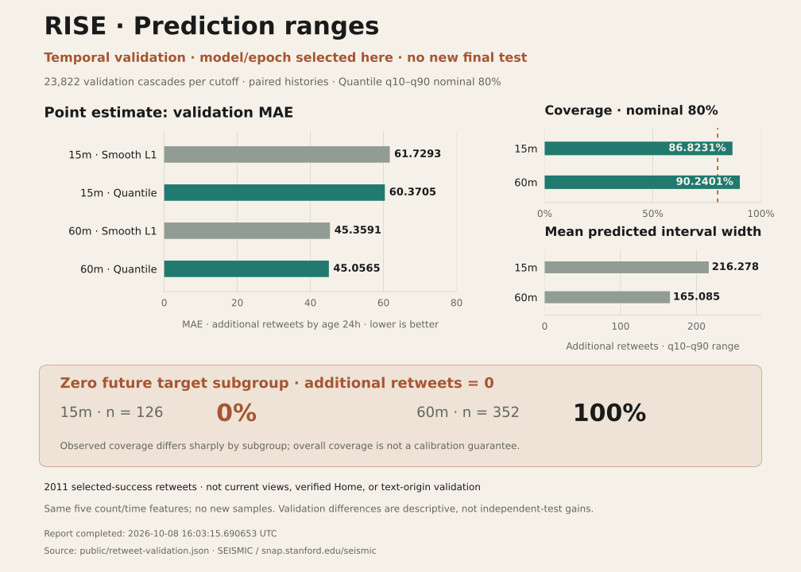

# RISE — Recursive Iterative Social Expansion

<p align="center"></p>

<p align="center"><a href="references/algorithm.md"></a> <a href="public/metrics.json"></a> <a href="LICENSE"></a></p>

<p align="center"><b>Recursive self-growth is the core idea.</b><br/>A Codex skill for X audience growth and higher-quality blue-check connections.<br/><a href="README.md">简体中文</a> · <a href="README.en.md">English</a></p>

## The recursive self-growth loop

**Share useful work on X → open-source the skill on GitHub → use, feedback and pull requests → publish reviewed observations → share new value on X → repeat.**

The X launch post links this repository. This README links that post and displays its actual feedback. Popularity is something to measure, not proof that the skill caused audience growth. No new value or evidence means no repeated promotional post.

**This skill is based on X's open-source recommendation algorithm, [xai-org/x-algorithm](https://github.com/xai-org/x-algorithm).** It uses action, observation, feedback and iteration to optimize both new blue-check followers and their high-quality share. Quality means relevant, original, substantive public content—not merely a badge. Growth is an optimization goal requiring validation, not an established or exponential-growth guarantee. This is not an official X or xAI product.

## Five actionable conclusions from the source



1. [Find the relevant audience](references/algorithm-field-guide.md#1-先找到相关受众再看互动数字): a one-way follow first changes your own retrieval; it does not establish increased exposure for your posts.
2. [Keep a professional topic](references/algorithm-field-guide.md#2-内容主线要和目标观看者匹配): discuss AI development, independent products and actual cases. No fixed hashtag boost is established.
3. [Separate pinned updates and originals](references/algorithm-field-guide.md#3-持续更新置顶同时区分更新与新内容): Home may merge or filter the same conversation. Independent discoveries justify new originals.
4. [Add information in each post](references/algorithm-field-guide.md#4-保持主题一致让每篇确实增加信息): author diversity operates within a candidate pool; DPP has startup and request gates, with production activation unknown.
5. [Measure acquisition and quality](references/algorithm-field-guide.md#5-优化真实目标不制造算法得分): weights multiply predictions. Your own action counts are not recommendation scores.

The [30-file manifest](references/upstream.json) binds official commit `78460ca8b65c57ddd3a05f9217c8aaeba214b628`. It is neither a complete source audit nor proof of production settings. [Execution conditions](references/algorithm.md). These strategies remain hypotheses requiring account experiments.

## Real observations

**Current challenge: exceed 100,000 actual followers.** Review checkpoints are 250, 1,000, 10,000 and 100,001; high-quality blue-check acquisition needs separate evidence. Arrival date is unknown. [Iteration checkpoints](references/road-to-100k.en.md).

**Additional operating target: increase original-content verified Home Timeline impressions toward 500,000 in 90 days.** New blue-check followers and their high-quality share remain targets. Reply impressions are excluded; eligibility counters and payout-qualified impressions remain separate. [Current X policy](https://help.x.com/en/using-x/original-content-rewards).



Latest actual capture **2026-10-08 07:58:18.986 UTC**: rolling 90-day verified Home Timeline impressions, excluding replies, remain **534 / 500,000 (0.1068%)**, a gap of **499,466**; **177 / 500 verified followers (35.4%)**, a gap of **323**. The backend verified category is neither a verified blue-only count nor a high-quality count. [Observed eligibility counters](public/reward-observations.json).

The first capture at **04:02:12.455 UTC** showed 534 impressions and 167 verified followers. At **05:28:49.830, 06:16:15.225 and 07:08:35.839 UTC**, verified followers read **171, 176 and 177**. The fifth capture is **49.72 minutes** after the fourth, with **zero net change in both counters**; first-to-last verified followers have a **+10 net change**, and all five rolling impression readings are 534. Their net change of zero does not establish zero incoming impressions, the absence of expiry or dashboard refresh behavior. No acquisition causality or reward eligibility is established. Forecasts and payout-qualified counts remain unknown. [Same-source rolling progress](public/reward-progress.json).

The additional model target is future 1-hour/24-hour per-post verified Home Timeline impression increments. Per-post labels are missing, so predictions remain unknown rather than total views multiplied by a verified ratio. Rolling 90-day progress must also subtract expiring impressions. X excludes automatically created or posted content from payout eligibility; Codex-posted experiments are not payout evidence. Human original creation, manual publication and automated research/statistics remain separately recorded. [Target and strategy limits](references/reward-reach.en.md).


<!-- RISE:METRICS:START -->
| Actual observation | Value |
| --- | --- |
| Total followers | 175 → 297 (+122) |
| Newly observed blue accounts | 24; confirmed new followers: unknown |
| Quality classification | 2 high / 2 not matched / 20 unclassified |
| High-quality share | Pending classification; unknown is not zero |
| Current observed-cohort window | 2026-10-08T00:23:58.426Z → 2026-10-08T05:14:58.325Z |
| Latest profile observation | 2026-10-08T17:15:25.134Z |
| Follower-list coverage at collection | 273/276 captured; list incomplete |
| Full-window high-quality share | Unknown; incomplete follower list |
| Previous independent cohort | 2 high / 3 not matched / 0 unclassified (n=5) |
| Observed-cohort quality lower / possible upper bound | 8.3%–91.7% |
| First profile observation | Timestamp unavailable |
| Earlier blue-count observation (separate window) | 2026-10-07T21:04:50.311Z |
| GitHub stars / forks | 1 / 0 · 2026-10-08T13:26:50.943894+00:00 |

Bounds describe the observed blue cohort, not confirmed new followers. Badge upgrades and handle changes remain possible. Public post counters may include self-interactions.

[RISE launch post](https://x.com/LIghtJUNction_x/status/2107943767382847844)

[Latest progress in the pinned thread](https://x.com/LIghtJUNction_x/status/2108241779099340888)
<!-- RISE:METRICS:END -->

Source: [public aggregate records](public/metrics.json). The initial untimed total was **175**; the measurement table above gives the latest dated totals. Concurrent account activity was visible and the first measurements predate the completed skill. Total change is neither blue-follower growth nor growth attributable to this skill. The existing partial observed cohort has 24 identities: **2 high, 2 not matched and 20 unknown**, with 4/24 assessed, over **2026-10-08T00:23:58.426Z → 05:14:58.325Z**. The historical five-account cohort is fully classified; the earlier twelve-account cohort still has one unknown. All remain independent.

The same 24-member cohort was **1 high / 2 not matched / 21 unknown** after its initial three assessments at `2026-10-08T05:31:52.616487+00:00`. A fourth assessment at `2026-10-08T05:56:28.390889+00:00` resolved one unknown as high, giving **2 / 2 / 20**. The captured-sample lower bound is **2/24 = 8.333%**, with a possible upper bound of **22/24 = 91.667%**. This reduces unknown classification; it is not new acquisition, follower growth or a causal improvement. That collection's coverage was **273/276 partial**, and 139 existing identities with unresolved badge history are excluded from arrivals. The original three reviews still lack complete evidence-capture clocks; the new follow-up's complete clock does not fill those gaps. Confirmed acquisition and the full-window quality share remain unknown.

A separate partial follower-list collection captured **279/282** accounts from **06:49:14.446 → 06:55:06.584 UTC**, finalized against the profile at **06:56:00.877 UTC**. Compared with the **05:14:58.325 UTC** snapshot, it recorded **six observed blue-account events**; the original frozen batch remains **0 high / 0 not matched / 6 unknown**. This comparison window is not the period since the preceding action. Incomplete lists, handle changes and badge changes prevent an exact new-blue acquisition count or full-window quality share. Earlier followbacks are not counted again.

A separate follow-up review at **2026-10-08 09:14:36.227350 UTC** records **1 high / 0 not matched / 5 unknown**, with **1/6 reviewed**. Within this six-event captured sample, the quality-share lower bound is **16.7%** and the possible upper bound is **100%**. This completes one quality label; it counts no new follower or high-quality growth and does not alter the original 24-, 5- or 12-member cohorts. The substantive evidence is limited to one author's specific troubleshooting self-report; effectiveness, news claims and human authorship remain unverified. Complete acquisition counts and the full-window quality share remain unknown.

An independent review completed at **07:12:22.839288 UTC** classified one independently selected blue account as high under the public-content rubric, using three complete recent posts and substantive discussion by that same author. A targeted profile capture at **07:08:07.479 UTC** already showed a blue badge, **Following** and **Follows you**. This review belongs to neither the old 24-member cohort nor the new six-arrival batch; it establishes neither a fresh follow action nor new acquisition or causal growth.

Reusable material: [three Git states in AI code review](references/ai-code-review-case.md), with bilingual explanations and reproduced command output.


A four-file synthetic experiment: [panel ordering after a retry](examples/panel_order_demo.py). Run `python examples/panel_order_demo.py`: modification-time ordering changes from `1→2→3→4` to `1→3→4→2`, while fixed panel indexes preserve `1→2→3→4`. It uses placeholder `.txt` files and explicitly assigned times to demonstrate sorting logic, without claiming actual comic generation or a product defect.

The [illustrated original post](https://x.com/LIghtJUNction_x/status/2108170130702344695), published at **2026-10-08 12:18:21 UTC**, links this repository's runnable script. Counters retain their individual observation times in the [public records](public/metrics.json); publication alone does not establish follower growth.



## X × GitHub feedback


Actual published examples, retaining only links accessible in this browser audit. Unavailable examples have been removed; historical observations remain preserved. [Link-availability audit](public/post-availability.json).

- [Prediction-range counterexample: all 126 zero-future cases fell outside the interval](https://x.com/LIghtJUNction_x/status/2108240460431134796)
- [Voice-consistency follow-up: blind-listen at joins and retain cost and regeneration counts](https://x.com/LIghtJUNction_x/status/2108090442583851205)
- [Real failed backtest: the small model has not beaten matched-window simple baselines](https://x.com/LIghtJUNction_x/status/2108064574675247167)
- [Developer feedback: reproduction entry, exclusion evidence and reasons for changes](https://x.com/LIghtJUNction_x/status/2108060803639500970)
- [Short-video experiment: repeat tasks and retain failures, time and costs](https://x.com/LIghtJUNction_x/status/2108067265497485702)
- [Independent algorithm original: follow direction and conversation filters](https://x.com/LIghtJUNction_x/status/2108028923200339985)
- [Keyframes and sample delivered to the requesting author](https://x.com/LIghtJUNction_x/status/2108025662980358354)
- [Harness training discussion: local and remote controls](https://x.com/LIghtJUNction_x/status/2108011337209270512)
- [Actual multi-model review command: reproducible advice for diff scope gaps](https://x.com/LIghtJUNction_x/status/2108007419154735157)
- [Answering an occlusion-labeling question with CVAT sources](https://x.com/LIghtJUNction_x/status/2108004713065230723)
- [Grounding AI copy in supplied facts](https://x.com/LIghtJUNction_x/status/2108000829303378383)
- [Continuing a discussion after audience feedback](https://x.com/LIghtJUNction_x/status/2107995153403465983)
- [Concrete dataset-validation reply](https://x.com/LIghtJUNction_x/status/2107976452662817134)
- [Debugging handoff reply](https://x.com/LIghtJUNction_x/status/2107977004314431778)
- [Initial Codex prompt experiment](https://x.com/LIghtJUNction_x/status/2107934424151335154)
- [Technical reply: what git diff does not show](https://x.com/LIghtJUNction_x/status/2107936031907737758)
- [Creator discussion: measuring follower quality](https://x.com/LIghtJUNction_x/status/2107936390185193718)
- [Responding to an AI video creator: voice consistency tests](https://x.com/LIghtJUNction_x/status/2107947524829127073)

The pinned launch post is the stable entry point: edit it when new evidence or improvements exist, or append a timestamped progress reply when editing is unavailable.

GitHub stars and forks refresh every six hours through GitHub Actions. X feedback refreshes only after an authorized browser observation. A GitHub refresh never changes the timestamp of old X data. No unattended X scheduler has been configured.

Earlier observations: the [algorithm-focused round](public/backtests/2026-10-08-algorithm.en.md) records **270 followers** at 02:49:34 UTC, net +14 from the earlier 256. Other videos and follow operations continued, preventing per-post attribution. Targeted Git advice had 10 views at 73.89 minutes, harness advice 9 at 59.93 minutes, and the source request 20 at 63.66 minutes. Its one response provided a source entry point from the same author. Neither technical suggestion had a technical response or profile visit; new high-quality acquisition remains unproven.

Completed older windows remain available: [matrix, 12 views at 60.11 minutes](public/backtests/2026-10-08-matrix.en.md); [technical case, 15 views at 60.38 minutes and one specific responding author](public/backtests/2026-10-08-technical-case.en.md); and [method post, 34 views at 67.15 minutes](public/backtests/2026-10-08.en.md). The matrix and technical-case original posts are currently inaccessible; these local reports preserve their observations. Posting age, versions and concurrent operations differ. Each report retains its original timestamps and captured denominators.

[Eight rough keyframes](https://x.com/LIghtJUNction_x/status/2108022019157873061) and a [12-second sample video](https://x.com/LIghtJUNction_x/status/2108025662980358354) were actually delivered to the author who requested help. Object destination remains unknown; continuous playback review remains pending. The [Luna API reply](https://x.com/LIghtJUNction_x/status/2108016718492909780) is untested advice. This is one ongoing relationship, not one new author or follower per message.

The [independent algorithm original](https://x.com/LIghtJUNction_x/status/2108028923200339985) was published at **02:57:15 UTC**, with image, ALT and source link reopened and verified. Initial counters were two views and zero interactions. Its actual 60-minute observation at **03:57:42.584 UTC** was 27.584 seconds late: 33 public views, zero external replies and one visible self-like, with zero independent likes. The next-day **02:57:15 UTC** 24-hour observation remains pending; this is not a fair A/B comparison.

The five-account observed cohort's 40% is unchanged. Two high-quality events in an incomplete older list, targeted reviews and the preceding phase's two blue followbacks remain separate. The two historical followback recipients' quality is still unknown; confirmed acquisition is not reported. No unattended X checks are configured. Earlier iterations passed **118**, **124**, **226** and **242 tests**. The current suite passes **255 tests**, including **41 authorship tests**.

The preceding conversation phase completed **four substantive replies, one like on received feedback and one related blue-account follow**. One author clarified that the model stayed fixed and liked the earlier reply; another suggested validating on independent posts. At that time, the followed author's quality and followback were unconfirmed; these historical action counts do not establish acquisition. Messages do not multiply independent authors.

The earlier interaction window completed **one original post, one substantive reply and one persisted blue-account followback to an existing follower**, whose quality remains unknown; the followback persisted at **07:11:43.790 UTC**. There were **zero likes or reposts**. The [video creator's feedback](https://x.com/clyve2022/status/2108083085367714123), published at **06:32:28 UTC**, describes segmented speech sounding like different people and plans a whole-paragraph versus segmented comparison this week. That is a planned test, not a measured result. The [Codex-disclosed reply](https://x.com/LIghtJUNction_x/status/2108090442583851205), published at **07:01:42 UTC**, recommends fixing the text and joins, blind-listening around each join and retaining costs and regeneration counts. It had **one public view** at **07:03:11.738 UTC** and **12 public views** at **07:20:38.398 UTC**, with **zero replies, reposts, likes or bookmarks** in both captures. The later reading is not a 60-minute result. The last observed verified Home count remains 534, and total followers stayed at 282 through that window's post-publication profile capture; no follower gain is attributed to these actions.

The [historical strict-acceptance original](public/metrics.json) was published at **2026-10-08 07:22:07 UTC** and publicly reopened at **07:24:20.681 UTC**, showing its full text, Codex disclosure and source link. The [current audit](public/post-availability.json) found its original post inaccessible. It reports the completed declared-group checks and **255 passing tests**; source commit **84adb04** also passed the [actual GitHub CI run](https://github.com/LIghtJUNction/x-quality-growth/actions/runs/37742589450). At publication, grouping declarations were checked rather than automatically inferred, and the origin classifier and verified Home model were untrained. The initial **one public view and zero replies, reposts, likes or bookmarks** do not establish audience-growth effectiveness. Its fixed 60-minute target of **2026-10-08 08:22:07 UTC** now has a [delayed proxy result](public/forecasts/rise-2108095581906428165-60m.evaluation.json): **9 public views at 08:24:17.712 UTC**, **130.712 seconds late**; the exact 60-minute actual remains unknown. No unattended check has been configured.

## Statistics and prediction: test against actual error



The latest profile reading is **283 followers / 276 following** at **2026-10-08 09:18:36.699 UTC**. Compared with this round's starting **282 / 274 at 08:58:07.735 UTC**, total followers have a net change of **+1**; exact new-blue acquisition and high-quality acquisition remain unknown.

This round completed **one persisted blue-account followback, one related blue-author follow and one [substantive reply](https://x.com/LIghtJUNction_x/status/2108123887909376093)**. The reply was published at **09:14:36 UTC** and first read at **09:16:57.527 UTC** with **2 views and zero replies, likes, reposts or bookmarks**. The early follow-up at **09:27:46.641 UTC** showed **9 views, one like and zero replies, reposts or bookmarks**, with Notifications at **09:26:09.710 UTC** attributing the like to the original discussion author rather than a self-like; no method response, adoption, completed test or acquisition is established. Five technical videos were visible concurrently, including two newly published this round by other tasks; they are excluded from the action counts above. The follower net change cannot be attributed to this round's interactions.

The older followback window, **07:59:32.891 → 08:09:38.594 UTC**, retains **282 / 271 → 282 / 272**: one existing blue follower was followed back and verified after reopening. Total followers were **282 → 282, net change zero**, while following increased by one; this is neither acquisition nor a quality improvement. The historical **281 / 272 at 08:35:09.886 UTC** was a net follower change of **−1** from 08:09, without confirming a blue-check follower loss. The initial **175 → 283 (+108)** change has no exact start time, is excluded from rates and is not this round's growth or a causal result. The five-account cohort's **40%** remains that observed cohort's quality share, not account-wide quality or confirmed acquisition.

Rate is `follower change / elapsed time`. Acceleration divides the change between two interval rates by the gap between their **window midpoints**, in followers/hour². These describe net changes; they cannot separate arrivals and departures or establish a growth mechanism. Post impressions, engagements, detail expands, profile visits and clicks retain their own sources and collection times. Public views and owner impressions stay separate; unattributed per-post acquisition remains null.



**Actual count fitting is complete; the curve has not outperformed the simple baseline.** PyTorch 2.14 trained two separate per-post curves on a single CPU thread, with only 3 parameters each. The final saved states use 19 correlated observation points, not 19 independent posts. The launch post has 7 evaluable rolling origins; each backtest uses only data available by that prediction origin.

The latest historical holdout spans **03:08:12.506 → 03:23:30.786 UTC**, about 15.30 minutes, with **661 actual views**. This is a historical next-point backtest, not a forecast published in advance. That prediction trained on the preceding 12 points; the final archive was subsequently refitted using the available history, including the holdout.

| Model | Latest holdout prediction | Absolute error, views | Matched-window MAE, views |
| --- | ---: | ---: | ---: |
| Keep the last value | 659 | 2 | **9.40** |
| Continue the recent rate | 668.85395 | 7.85395 | 12.30 |
| Three-parameter PyTorch curve | 673.22592 | 12.22592 | 28.30 |

MAE means mean absolute error; lower is better. The last column compares **the same 5 origins and targets from one launch post, at 15–60-minute horizons**. These observations are correlated and do not establish cross-post generalization or statistical superiority. The 24-hour extrapolation has no actual result yet, and uncertainty intervals remain unknown. Exposure forecasts do not predict blue-check acquisition or a date for reaching 100,000 followers.

**The first baseline frozen before its outcome now has a real observation:** the new case post had 14 public views at `05:49:55.484 UTC`. Predictions for post age 60 minutes (`06:18:55 UTC`) are **14** for the last-value baseline and **27.7904** for the recent-rate baseline. They were sealed at `05:52:29 UTC` and [committed to GitHub before the target](https://github.com/LIghtJUNction/x-quality-growth/commit/e792e3771668e3f4945a0b90f257eb84a5a44bfa). The first successful numeric capture at `06:19:28.906 UTC` read **26 views**, at post age **60 minutes 33.906 seconds**. The exact 60-minute count remains unknown; this uses the declared delayed-observation proxy. Single absolute errors are **12 / 1.79036**, with **one post and one future target**, not evidence of stable superiority. The [frozen file](public/forecasts/rise-2108064574675247167-60m.json) stays unchanged; the [real evaluation](public/forecasts/rise-2108064574675247167-60m.evaluation.json) is separate. This predicts from post age about 31 minutes to age 60, **not another hour into the future**. The old PyTorch model did not participate, no new model was trained, and verified Home impressions are not predicted. [Freeze and evaluation protocol](references/prospective-prediction.en.md).



**The second post has a late observed result: 9 public views.** Its [frozen record](public/forecasts/rise-2108095581906428165-60m.json) was sealed at **07:51:59 UTC**. Public-view predictions for post age 60 minutes (**08:22:07 UTC**) are **3** for the last-value baseline and **6.1998386** for the recent-rate baseline; the late-observation deadline is **08:27:07 UTC**. [GitHub commit `8325e05`](https://github.com/LIghtJUNction/x-quality-growth/commit/8325e05) has a commit timestamp of **07:57:50 UTC**, and the [successful CI run](https://github.com/LIghtJUNction/x-quality-growth/actions/runs/37746720556) was created server-side at **07:57:56 UTC**, establishing a public record before the target.

The first read at **08:22:44.363 UTC** was still Loading and remains `null`, not zero. The first successful read was **9 public views at 08:24:17.712 UTC**, at post age **62 minutes 10.712 seconds**, **130.712 seconds** after the target. It falls inside the predeclared **300-second** window and serves only as a delayed proxy; the exact 60-minute actual remains `null`. The [evaluation record](public/forecasts/rise-2108095581906428165-60m.evaluation.json) gives single-observation absolute errors of **6** for last value and **2.80016** for recent rate. Targets from two different native posts do not establish independent samples or stable superiority. The old PyTorch model is excluded; no new model was trained, and verified Home impressions are not predicted.

**A third post retains its frozen 60-minute predictions and delayed observation.** The [forecast](public/forecasts/rise-2108170130702344695-60m.json) was sealed at **2026-10-08 12:46:17.843559 UTC**, predicting public views at **13:18:21 UTC**: **15** for last value and **69.19827** for recent rate. The first target read at **13:19:08.281 UTC** was Loading and stays `null`. The first successful read at **13:19:39.278 UTC** showed **91 views**, at post age **61 minutes 18.278 seconds**, **78.278 seconds** late and within the predeclared **90-second** window. [Single absolute errors](public/forecasts/rise-2108170130702344695-60m.evaluation.json) are **76 / 21.80173**; the exact 60-minute actual remains unknown and the frozen file is unchanged. This is one delayed target proxy. The recent rate comes from an approximately 86-second interval; operator opens and asynchronous counters may affect it. Stable superiority, verified Home reach and follower acquisition are unproven; the old PyTorch and origin classifier did not participate.

**Newly completed historical-retweet experiment: SEISMIC retweet-v2.** Completed at **2026-10-08 10:29:36.524651 UTC**, it trained two tiny MLPs on one CPU thread, with **241 parameters per cutoff, 482 total**. At post ages **15 minutes / 60 minutes**, the target is **additional retweets after the cutoff through post age 24 hours**, not views, next-hour views or verified Home impressions. The five inputs are the `log1p` of the observed count, first/last retweet time fractions, a zero-at-cutoff indicator and the cutoff time fraction; future events and text are excluded.



The final table contains **165,929 canonical, non-repeated source-post cascades and 331,858 paired cutoff rows**. Each cutoff uses a chronological outer split of **59,565 training / 12,193 label-maturity-overlap purged / 94,171 test cascades**. Both rows from a post stay in the same split and are not two independent samples. Within outer training, a chronological **23,779 fit / 11,964 purge / 23,822 validation** split selected **14 epochs at 15 minutes and 10 at 60 minutes**. Models were then refitted on all outer training data; the test was evaluated **once**.

| Model | 15-minute cutoff MAE, additional retweets | 60-minute cutoff MAE, additional retweets |
| --- | ---: | ---: |
| Zero additional: keep cutoff count | 109.18 | 76.34 |
| Constant training-target median | 77.85 | 59.33 |
| Continue early constant rate | 7,000.12 | 2,402.23 |
| Training-count bucket median | 63.18 | 47.08 |
| Tiny MLP | **60.40** | **45.71** |

Each column is mean absolute error on **94,171 later test cascades at that cutoff**. The MLP's overall MAE is **4.41% / 2.90%** lower than the bucket baseline, a descriptive difference in this test; confidence intervals and statistical superiority are unknown. [Public aggregates](public/retweet-benchmark.json). The older view curves from two posts and 19 correlated observations, including their failed **28.30 versus 9.40** backtest, remain separate; these metrics and models are not pooled.

**The MLP does not win everywhere.** In the 15-minute zero-retweet subgroup, **n=881**, MLP MAE is **61.98825**, worse than bucket **61.72304**. Across the 60-minute test, p90 absolute error is **105.18341 versus 105.00000**, also worse. The source is **2011 English, hashtag-free and selected using future retweet success**; author, duplicate-text and topic groups are unknown, and data licensing remains unresolved. This is not validation of current-account views or follower growth. Verified Home prediction remains untrained; language transfer and universal superiority are unproven. [Data, splits and limitations](references/data-reuse.en.md).


The new model is separately published at [Hugging Face / RISE-retweet-baseline](https://huggingface.co/LIghtJUNction/RISE-retweet-baseline), pinned to `1282fc5e88e64073bf680b0dda21663f19b73c69`. At **2026-10-08 10:55:16.800135 UTC**, anonymous downloads of all seven files matched their SHA values and standard-library synthetic inference ran successfully. Both models' weights and normalizers equal the frozen training state; raw sources and row predictions were not uploaded. [Release verification](public/hf-retweet-release.json) · [Reproduce preparation and training](references/data-reuse.en.md#reproduce-preparation-and-training).

The [new model-result sharing reply](https://x.com/LIghtJUNction_x/status/2108155423509696529) is in the fixed pinned conversation, with the actual chart, HF/GitHub links and Codex disclosure. It was first published at **2026-10-08 11:19:55 UTC**; the independent reopen at **11:22:55.423 UTC** showed **1 public view and zero replies/reposts/likes/bookmarks**. This verifies publication, not independent audience, adoption or growth. A delayed 60-minute observation at **12:21:06.334 UTC** showed **25 public views and zero replies/reposts/likes/bookmarks**, at actual post age **61 minutes 11.334 seconds**; the exact 60-minute count remains unknown. An independent owner capture at **12:21:37.577 UTC** showed **24 ordinary impressions, 1 engagement, 1 detail expand and 0 profile visits**, with unknown link clicks; these counters are kept separate. The 24-hour follow-up remains pending, with no unattended scheduler.

**New retweet prediction ranges: trained and published, no new final test.** Completed at **2026-10-08 16:03:15.690653 UTC**, the quantile models have **259 parameters per cutoff**, using the same five time/count features and historical data. The inner split is **23,779 fit / 11,964 purge / 23,822 validation**; this validation set selected both models and epochs. Final-test labels were not read, and no new samples were added. [Aggregate report](public/retweet-validation.json).



| Post-age cutoff | Original point model → quantile median MAE | Observed coverage of nominal 80% interval | Mean interval width, additional retweets |
| --- | ---: | ---: | ---: |
| 15 minutes | 61.72927 → **60.37052** | 86.8231% | 216.278 |
| 60 minutes | 45.35910 → **45.05648** | 90.2401% | 165.085 |

**Intervals are broad, and subgroup failure stays visible:** the 15-minute subgroup with **zero additional retweets through age 24 hours has n=126 and 0% coverage**; the corresponding 60-minute subgroup has **n=352 and 100% coverage**. Overall coverage above nominal 80% does not establish calibration. These model-selection validation results cannot be pooled with the earlier final test or establish current X views, verified Home reach or acquisition.

The quantile model is published at [Hugging Face / RISE-retweet-quantiles, fixed revision](https://huggingface.co/LIghtJUNction/RISE-retweet-quantiles/tree/2a72cfa931dafdd3c0a630aa71a5e333ec4c053c), revision `2a72cfa931dafdd3c0a630aa71a5e333ec4c053c`. At **2026-10-08 16:24:19.413543 UTC**, anonymous downloads of all six release files returned HTTP 200 and matched their SHA values. Six standard-library synthetic inference probes exited 0 with finite nonnegative, ordered quantiles; the complete tree contains only those files plus `.gitattributes`. [Release verification](public/retweet-quantiles-release.json). This verifies executable public reproduction; synthetic inputs do not validate predictive performance, current-account transfer or reach recovery.

**Latest content experiment: lead with a concrete failure.** The [illustrated original](https://x.com/LIghtJUNction_x/status/2108240460431134796) was published at **2026-10-08 16:57:49 UTC** and reopened, presenting the 15-minute counterexample above: overall coverage of 86.8% missed all 126 zero-future cases. It includes Chinese ALT text; results remain limited to inner validation on 2011 data. The early read at **17:06:59.517 UTC** showed **10 public views, 1 repost and zero replies/likes/bookmarks**, not a 60-minute result. Reposter identity and independence are unverified; causal effects, new-blue acquisition and high-quality acquisition remain unknown.

A [progress reply in the fixed pinned conversation](https://x.com/LIghtJUNction_x/status/2108241779099340888) was added at **17:03:04 UTC**, preserving the original pinned entry. The reopen at **17:04:59.264 UTC** showed **1 public view and zero replies/reposts/likes/bookmarks**. The original's **60-minute target is 2026-10-08 17:57:49 UTC; its 24-hour target is 2026-10-09 16:57:49 UTC**. Both observations are pending, with no unattended checks scheduled.

The view curves and retweet heat models use only times, counts and derived features; measured platform coverage remains X / historical Twitter. The origin classifier below is a separate research task and is not a heat input. A unified contract for text, images, video and comments is designed; media semantics are not training inputs and other platform adapters are unvalidated. The official popular-pool reference score is not a future-exposure forecast. [Statistical methods](references/growth-statistics.en.md) · [Input contract](references/model-inputs.en.md) · [Official time parameters](references/algorithm-time.md) · [Recommendation formulas and limits](references/recommendation-formulas.md)

**A text-origin research baseline is locally trained: HC3 Chinese open-QA binary classification.** Completed at **2026-10-08 16:07:41.421724 UTC**, it distinguishes dataset-labelled human answers from early ChatGPT answers; mixed writing was not trained. On [1,683 test answers](public/authorship-benchmark.json), forced binary benchmark accuracy is **95.37%**, versus **73.56%** for the length baseline. This is a connected-group holdout of QA answers, with unknown creation times, not a time holdout. Real-author independence and applicability to current generators or X short posts remain unvalidated.

**The inference-supported subset performs worse:** only **210 / 1,683 (12.48%)** meet the restricted long-Chinese, explicitly declared HC3-domain conditions, with **205 AI / 5 human labels**. Model accuracy is **87.14%**, below **97.62%** for always predicting AI in that subset. Overall 95.37% therefore is not a deployment result. Default X inputs return **`unknown` and null probabilities**; the model does not identify authors, invent mixed-writing probabilities, rate quality or make acquisition decisions.

The research baseline is published at [Hugging Face / RISE-HC3-source-baseline, fixed revision](https://huggingface.co/LIghtJUNction/RISE-HC3-source-baseline/tree/ae590ac0e4eb16ff810bf5b651480be2b938c348), revision `ae590ac0e4eb16ff810bf5b651480be2b938c348`. At **2026-10-08 16:32:26.892800 UTC**, anonymous downloads of all eight release files returned HTTP 200 and matched their SHA values; the complete tree contains only those files plus `.gitattributes`. Synthetic inference exited 0: default X inputs stayed unknown, explicit HC3 binary probabilities summed to 1, and three-class requests stayed unknown. [Release verification](public/authorship-release.json). These checks verify executable public code and out-of-domain rejection, not real X-origin detection, author identity or acquisition.

The [input and probability validator](scripts/authorship.py) checks native identity and declared content-group overlap: X uses `x` and canonical numeric post IDs; edits, shared material and the same concrete event must stay in one group. This does not independently verify declared grouping or lineage. Verified Home prediction remains untrained, and no heat improvement from origin features has been measured. These probabilities measure neither quality nor the fraction of AI-written characters. [Labels and validation](references/model-inputs.en.md) · [Existing resource reuse](references/data-reuse.en.md).

Reproduce the three aggregate outputs. The first two use the Python standard library; curve training additionally requires PyTorch:

```sh
python3 scripts/growth_dynamics.py --output public/growth-dynamics.json
python3 scripts/post_statistics.py --output public/post-statistics.json
python3 scripts/predict_heat.py --model torch --output public/heat-prediction.json --model-outputpath runs/heat-model-state.json
python3 scripts/reward_progress.py --outputpath public/reward-progress.json
```

[Follower dynamics](public/growth-dynamics.json) · [Post statistics](public/post-statistics.json) · [Prediction backtests](public/heat-prediction.json). The model state, reproducible code and honest backtests are public on [Hugging Face / RISE-heat-baseline](https://huggingface.co/LIghtJUNction/RISE-heat-baseline), pinned revision `ab23b84bfe1a46f8b9b8b604f200461d59ba6ca9`; downloaded state and model card match local SHA-256 hashes. Download that revision with the Hugging Face CLI and reproduce it:

```sh
hf download LIghtJUNction/RISE-heat-baseline inference.py model-state.json --revision ab23b84bfe1a46f8b9b8b604f200461d59ba6ca9 --local-dir rise-heat-replay
cd rise-heat-replay
python inference.py --state model-state.json --post-id 2107943767382847844 --age-seconds 25200
```

The anonymous-download run returned `curve_value: 806.4055879746555`. This reads an archived fitted curve for an existing post at age 25,200 seconds. Inference uses only the Python standard library, with no PyTorch or GPU required. New posts need a new fit; text and media are not inputs yet. On the same five matched backtest points from one post, model MAE was **28.30**, versus **9.40** for the last-value baseline; the model had higher error.

The [historical X reproduction tutorial](public/post-statistics.json) quotes the [existing real-backtest image post](https://x.com/LIghtJUNction_x/status/2108064574675247167), links to HF and discloses Codex authorship. The [current audit](public/post-availability.json) found the tutorial post inaccessible. It was first published at **08:33:46 UTC** and edited at **08:43:46 UTC** to fix the displayed script name: **one publication and one edit**. The edit neither resets post age nor adds an independent sample. Its then-latest version was reopened and checked; its first capture showed **2 views and zero replies, reposts, likes or bookmarks**.

The 60-minute follow-up now has a late actual reading: **2026-10-08 09:34:38.250 UTC**, at post age **60 minutes 52.250 seconds**, with **9 public views and zero replies, reposts, likes or bookmarks**. The exact 60-minute actual remains unknown; this is not an evaluation of a frozen numerical forecast. A separate owner-analytics capture at **09:35:35.314 UTC** showed **9 ordinary post impressions, 2 engagements, 2 detail expands, 0 profile visits and 0 link clicks**. These are neither verified Home impressions nor unique people; operator opens may contribute. HF downloads are not tracked; external usage and reproduction are unknown and cannot be reported as zero. The original is now unavailable, so unfinished 24- and 72-hour follow-ups are cancelled with unknown outcomes. That tutorial shared the existing model without new training; its historical counters do not establish reach or growth recovery.

The earlier statistics, prediction and eligibility-measurement iteration passed **224 tests** and skill validation; that is a historical check, separate from the current 255-test suite above.

The next round fixes 60-minute, 24-hour and 72-hour windows, changes one primary factor at a time and records concurrent operations. Accumulate comparable post or date blocks; refreshing a page or receiving several replies from one author does not create independent samples. Evaluate high-quality acquisition, cohort retention, effort and prediction error separately, retaining simple baselines when the model does not improve them.

**Next reach experiment:** among the [latest owner-panel observations for 15 distinct posts](public/metrics.json), 14 recorded zero profile visits. Their windows differ and cannot be pooled into a conversion rate; detail opens, profile visits and link clicks are not a nested funnel of the same people. Create original, runnable work with new value, testing new readers' attention, concrete reasons to share and substantive feedback while reducing repeated skill-progress promotion. The [reach experiment lab](references/reach-expansion-lab.md) reviews selected distribution paths at official commit `35650fb`: the vertical-video module's public switch defaults to **false**, while the existing audited manifest remains pinned to `78460ca`. This is neither a full new-version audit nor evidence of enablement for this account. The concrete-failure direction has now been tried in the original linked above; the proposed coordinate demonstration and the other two directions remain unexecuted. Unfamiliar-reader identity and missing per-post verified Home values remain unknown.

## Install and run

```sh
git clone https://github.com/LIghtJUNction/x-quality-growth.git ~/.codex/skills/x-quality-growth
```

For an existing source checkout, install with a symlink and keep iterating in that source directory. Do not overwrite an existing skill.

```text
Use $x-quality-growth on my currently signed-in X account.
Audience: AI tools, independent developers and product builders.
Authorized actions: original posts, likes, substantive replies, selected quotes,
following relevant blue-check accounts and following back blue-check followers.
Record a baseline, execute one small batch and verify persistent results.
Optimize new blue-check followers and their high-quality share, then report evidence.
Stop the affected action if the platform limits it.
```

The skill drives Codex in an available, authenticated browser. Its scripts are offline measurement tools, not an always-on X bot, credential store or private-API client. Scheduled browser sessions require an available scheduler to be actually configured.

## Reproducible measurement

Basic measurement uses Python 3.10+ and the standard library; optional curve training additionally requires PyTorch:

```sh
python3 scripts/measure.py examples/before.json examples/after.json
python3 -m unittest discover -s tests -v
python3 scripts/audit_source.py --source /path/to/x-algorithm --output references/upstream.json
python3 scripts/render_public.py
python3 scripts/diagnose_growth.py
python3 scripts/plan_update.py plan --language en --change 'An actual completed improvement'
python3 scripts/contribute.py --sync  # inspect; authorized iteration uses --apply --sync
```

[Skill entry point](SKILL.md) · [Pinned algorithm evidence](references/algorithm.md) · [Measurement rules](references/measurement.md) · [Source manifest](references/upstream.json)

Weights multiply predicted values, not counts. No "one reply equals ten likes" arithmetic. Stable IDs, incomplete lists, badge upgrades, renames, unknown classifications and unavailable counters are handled separately. Unknown data is not zero; zero arrivals have no quality rate. Source defaults do not establish every production request's configuration.

## Fork, iterate and contribute upstream

With accessible GitHub MCP or authenticated `gh`, the skill checks and creates a personal fork, iterates there and syncs upstream. At the review cadence, submit or update a PR only for actual improvements. Reuse forks, branches and existing PRs; preserve unrelated changes. The upstream author works directly on the source repository.

Run `python3 scripts/contribute.py --apply --sync` for verified fork creation/reuse and conservative local synchronization. The upstream maintainer skips a self-fork; unrelated remotes and uncommitted work remain preserved.

See [contribution workflow](references/contributing.md). The default cadence is a weekly review; configure it only when a scheduler is available. No empty PRs or fictional background schedules.

## Keep the evidence current

The official algorithm is reviewed every Monday at 03:43 UTC. Unchanged revisions create no empty PR; new revisions generate a pending report and attempt a draft PR in the current repository. Semantic review precedes updating approved evidence. [Weekly source review and limitations](references/upstream-review.md). This does not schedule cross-fork contributions or X browser operations.

Maintain the code in the source checkout. Private account lists stay in ignored `runs/`; only reviewed aggregate observations enter this public repository. Re-render both language tables and SVGs after a real X measurement. Re-read changed upstream code before updating algorithm conclusions.

MIT for original code and documentation. The referenced X algorithm is Apache-2.0; it is not bundled here. No controlled growth experiment or proven growth rate is claimed.

Public engagement counters may include the account owner’s likes or progress replies; self-engagement is not independent audience endorsement.

## Diagnosing slower growth

Check confirmed actions, exposure, substantive replies, followers and quality in that order. Rates use exactly timed observations and describe net total-follower change. They do not establish new-blue-follower growth or causality. Unmatched windows and concurrent activity prevent declaring a strategy winner or platform throttling.

[Growth diagnostics](references/growth-diagnostics.md) · [Pinned-thread update planning](references/pinned-updates.md)
