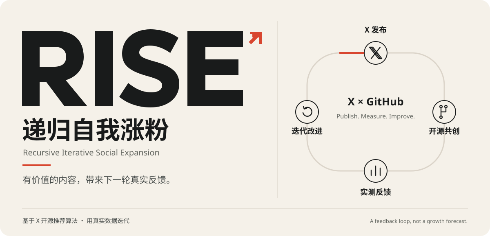
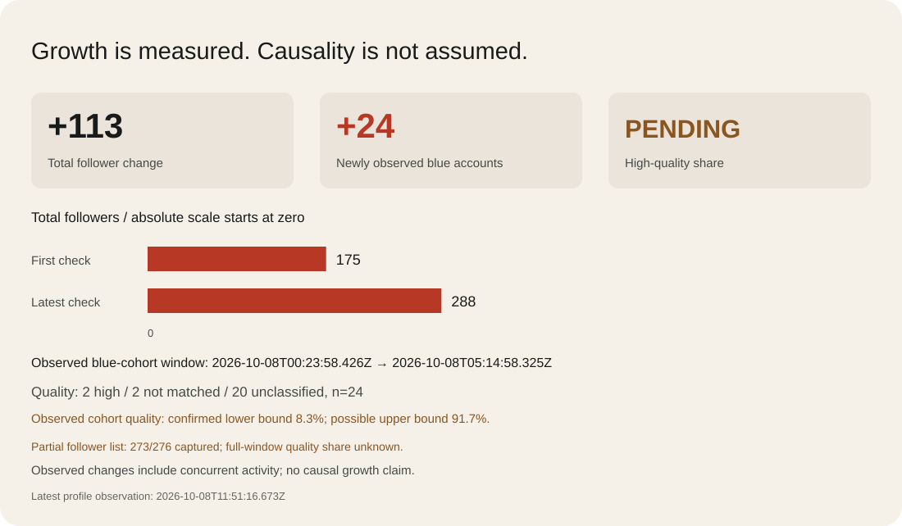
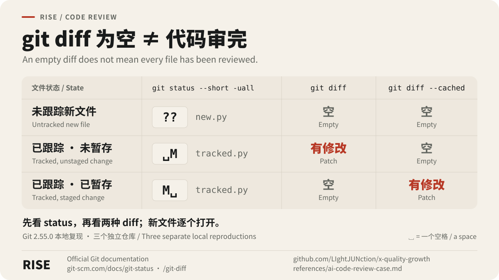
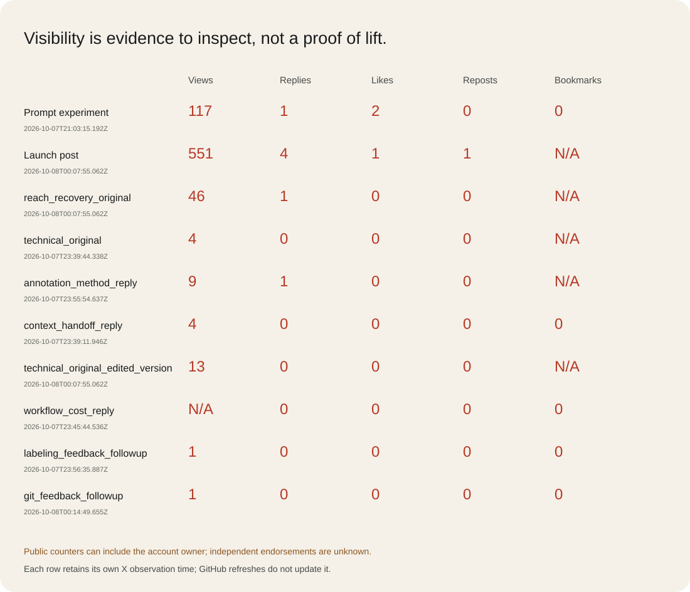

# RISE — Recursive Iterative Social Expansion

<p align="center"></p>

<p align="center"><a href="references/algorithm.md"></a> <a href="public/metrics.json"></a> <a href="LICENSE"></a></p>

<p align="center"><b>Recursive self-growth is the core idea.</b><br/>A Codex skill for X audience growth and higher-quality blue-check connections.<br/><a href="README.md">简体中文</a> · <a href="README.en.md">English</a></p>

## The recursive self-growth loop

**Share useful work on X → open-source the skill on GitHub → use, feedback and pull requests → publish reviewed observations → share new value on X → repeat.**

The X launch post links this repository. This README links that post and displays its actual feedback. Popularity is something to measure, not proof that the skill caused audience growth. No new value or evidence means no repeated promotional post.

**This skill is based on X's open-source recommendation algorithm, [xai-org/x-algorithm](https://github.com/xai-org/x-algorithm).** It uses action, observation, feedback and iteration to optimize both new blue-check followers and their high-quality share. Quality means relevant, original, substantive public content—not merely a badge. Growth is an optimization goal requiring validation, not an established or exponential-growth guarantee. This is not an official X or xAI product.

## Real observations

**Current challenge: exceed 100,000 actual followers.** Review checkpoints are 250, 1,000, 10,000 and 100,001; high-quality blue-check acquisition needs separate evidence. Arrival date is unknown. [Iteration checkpoints](references/road-to-100k.en.md).



<!-- RISE:METRICS:START -->
| Actual observation | Value |
| --- | --- |
| Total followers | 175 → 254 (+79) |
| Newly observed blue accounts | 5; confirmed new followers: unknown |
| Quality classification | 2 high / 3 not matched / 0 unclassified |
| High-quality share | 40.0% |
| Current observed-cohort window | 2026-10-07T22:58:02.912Z → 2026-10-08T00:10:06.403Z |
| Latest profile observation | 2026-10-08T01:15:14.382Z |
| Previous independent cohort | 0 high / 11 not matched / 1 unclassified (n=12) |
| Observed-cohort quality lower / possible upper bound | 40.0%–40.0% |
| First profile observation | Timestamp unavailable |
| Earlier blue-count observation (separate window) | 2026-10-07T21:04:50.311Z |
| GitHub stars / forks | 1 / 0 · 2026-10-07T21:22:27.159136+00:00 |

Bounds describe the observed blue cohort, not confirmed new followers. Badge upgrades and handle changes remain possible. Public post counters may include self-interactions.

[RISE launch post](https://x.com/LIghtJUNction_x/status/2107943767382847844)

[Latest progress in the pinned thread](https://x.com/LIghtJUNction_x/status/2108004228832866696)
<!-- RISE:METRICS:END -->

Source: [public aggregate records](public/metrics.json). The exact time of the first total-follower check was not retained. Concurrent account activity was visible, and the first measurements predate the completed skill. Total follower change is not blue-follower growth. Verified-list arrivals may include existing followers receiving a badge. The current five-account observed cohort is fully classified; the earlier twelve-account cohort still has one unknown and is retained separately. We keep those limitations visible.

Reusable material: [three Git states in AI code review](references/ai-code-review-case.md), with bilingual explanations and reproduced command output.



## X × GitHub feedback



Actual published examples:

- [Three-state Git matrix: an empty diff does not complete review](https://x.com/LIghtJUNction_x/status/2107994469098508741)
- [Answering an occlusion-labeling question with CVAT sources](https://x.com/LIghtJUNction_x/status/2108004713065230723)
- [Grounding AI copy in supplied facts](https://x.com/LIghtJUNction_x/status/2108000829303378383)
- [Continuing a discussion after audience feedback](https://x.com/LIghtJUNction_x/status/2107995153403465983)
- [Reproduced AI code-review case](https://x.com/LIghtJUNction_x/status/2107979675960299994)
- [Concrete dataset-validation reply](https://x.com/LIghtJUNction_x/status/2107976452662817134)
- [Debugging handoff reply](https://x.com/LIghtJUNction_x/status/2107977004314431778)
- [Initial Codex prompt experiment](https://x.com/LIghtJUNction_x/status/2107934424151335154)
- [Technical reply: what git diff does not show](https://x.com/LIghtJUNction_x/status/2107936031907737758)
- [Creator discussion: measuring follower quality](https://x.com/LIghtJUNction_x/status/2107936390185193718)
- [Responding to an AI video creator: voice consistency tests](https://x.com/LIghtJUNction_x/status/2107947524829127073)

The pinned launch post is the stable entry point: edit it when new evidence or improvements exist, or append a timestamped progress reply when editing is unavailable.

GitHub stars and forks refresh every six hours through GitHub Actions. X feedback refreshes only after an authorized browser observation. A GitHub refresh never changes the timestamp of old X data. No unattended X scheduler has been configured.

Previous-round recheck: [the technical case at about 60 minutes](public/backtests/2026-10-08-technical-case.en.md). Latest edited version: 15 views, one specific external response, zero profile visits. The account went 246→251 and passed the 250-follower checkpoint; acquisition is not attributable to this post. The [earlier 67-minute review](public/backtests/2026-10-08.en.md) is retained. The new [three-state matrix observation](public/backtests/2026-10-08-matrix.en.md) has started; fixed-window rechecks are pending.

The previous technical-case round verified one original and three substantive replies; edited versions are not extra originals. A [labeling follow-up](https://x.com/LIghtJUNction_x/status/2107983282281627907) and [Git discussion](https://x.com/LIghtJUNction_x/status/2107987971232375079) were also reopened. A complete verified-list recheck went from 137 to 142 handles: five newly observed blue accounts, two high / three not matched / zero unknown (40% of that observed cohort). Confirmed new-follower acquisition remains unknown. By 00:25 UTC, five blue-follower followbacks persisted after reloading. The roughly 60-minute review is complete; the 24-hour check is due at October 8, 23:26 UTC.

The two later pending blue-event reviews are complete under the fixed audience rubric: 0 high / 2 not matched / 0 unknown. These are separate targeted follow-ups, not a complete new-acquisition cohort. They do not alter the five-account 40% cohort or establish a current new-follower quality rate of 0%.

**Latest iteration:** a [three-state original image post](https://x.com/LIghtJUNction_x/status/2107994469098508741) was published on October 8 at 00:40:20 UTC. One [audience-feedback follow-up](https://x.com/LIghtJUNction_x/status/2107995153403465983), one [fact-grounding reply](https://x.com/LIghtJUNction_x/status/2108000829303378383), one like on its latest edited parent, and one blue-follower followback were verified. The early 00:56 observation found 253 followers: +1 from the pre-post baseline of 252, +2 from the preceding round's 251. The post had 4 views at only 16.10 minutes of age, **not a 60-minute result**. Concurrent operations prevent attribution to this post.

A later 01:15 UTC profile check showed **254 followers**, +3 from the preceding 251 and +2 from the pre-post 252; the graphic had 6 views before its 60-minute checkpoint. This later total does not replace the earlier list window or fill its missing identities.

The all-followers capture retained 251 identities, two fewer than the profile's 253, so it is incomplete. Relative to the earlier 249-identity baseline, two previously unlisted identities were captured. Both currently have blue badges; three full recent originals per account were reviewed, yielding 2 high / 0 not matched / 0 unknown. These are observed events in an incomplete list, not proof that all new blue followers total two or that the full window's quality share is 100%. Exact acquisition and full-window quality share remain unknown; the five-account 40% cohort is unchanged. The [round's observation record](public/backtests/2026-10-08-matrix.en.md) retains the capture gap and timestamps. Its 60-minute check is due at 01:40:20 UTC, still pending; no unattended checks are configured. Table presentation, case expansion and the previous post's edit differ, preventing a fair A/B comparison or a growth promise.

Later feedback included one copywriting-author like and a brief affirmation; neither is treated as a technical method response or new acquisition. A further labeling question was [answered with official CVAT references](https://x.com/LIghtJUNction_x/status/2108004713065230723); it is from the same labeling author. The measurement tool now exposes captured denominators and coverage separately; 118 tests passed.

## Install and run

```sh
git clone https://github.com/LIghtJUNction/x-quality-growth.git ~/.codex/skills/x-quality-growth
```

For an existing source checkout, install with a symlink and keep iterating in that source directory. Do not overwrite an existing skill.

```text
Use $x-quality-growth on my currently signed-in X account.
Audience: AI tools, independent developers and product builders.
Authorized actions: original posts, likes, substantive replies, selected quotes,
following relevant blue-check accounts and following back blue-check followers.
Record a baseline, execute one small batch and verify persistent results.
Optimize new blue-check followers and their high-quality share, then report evidence.
Stop the affected action if the platform limits it.
```

The skill drives Codex in an available, authenticated browser. Its scripts are offline measurement tools, not an always-on X bot, credential store or private-API client. Scheduled browser sessions require an available scheduler to be actually configured.

## Reproducible measurement

Python 3.10+, standard library only:

```sh
python3 scripts/measure.py examples/before.json examples/after.json
python3 -m unittest discover -s tests -v
python3 scripts/audit_source.py --source /path/to/x-algorithm --output references/upstream.json
python3 scripts/render_public.py
python3 scripts/diagnose_growth.py
python3 scripts/plan_update.py plan --language en --change 'An actual completed improvement'
python3 scripts/contribute.py --sync  # inspect; authorized iteration uses --apply --sync
```

[Skill entry point](SKILL.md) · [Pinned algorithm evidence](references/algorithm.md) · [Measurement rules](references/measurement.md) · [Source manifest](references/upstream.json)

Weights multiply predicted values, not counts. No "one reply equals ten likes" arithmetic. Stable IDs, incomplete lists, badge upgrades, renames, unknown classifications and unavailable counters are handled separately. Unknown data is not zero; zero arrivals have no quality rate. Source defaults do not establish every production request's configuration.

## Fork, iterate and contribute upstream

With accessible GitHub MCP or authenticated `gh`, the skill checks and creates a personal fork, iterates there and syncs upstream. At the review cadence, submit or update a PR only for actual improvements. Reuse forks, branches and existing PRs; preserve unrelated changes. The upstream author works directly on the source repository.

Run `python3 scripts/contribute.py --apply --sync` for verified fork creation/reuse and conservative local synchronization. The upstream maintainer skips a self-fork; unrelated remotes and uncommitted work remain preserved.

See [contribution workflow](references/contributing.md). The default cadence is a weekly review; configure it only when a scheduler is available. No empty PRs or fictional background schedules.

## Keep the evidence current

The official algorithm is reviewed every Monday at 03:43 UTC. Unchanged revisions create no empty PR; new revisions generate a pending report and attempt a draft PR in the current repository. Semantic review precedes updating approved evidence. [Weekly source review and limitations](references/upstream-review.md). This does not schedule cross-fork contributions or X browser operations.

Maintain the code in the source checkout. Private account lists stay in ignored `runs/`; only reviewed aggregate observations enter this public repository. Re-render both language tables and SVGs after a real X measurement. Re-read changed upstream code before updating algorithm conclusions.

MIT for original code and documentation. The referenced X algorithm is Apache-2.0; it is not bundled here. No controlled growth experiment or proven growth rate is claimed.

Public engagement counters may include the account owner’s likes or progress replies; self-engagement is not independent audience endorsement.

## Diagnosing slower growth

Check confirmed actions, exposure, substantive replies, followers and quality in that order. Rates use exactly timed observations and describe net total-follower change. They do not establish new-blue-follower growth or causality. Unmatched windows and concurrent activity prevent declaring a strategy winner or platform throttling.

[Growth diagnostics](references/growth-diagnostics.md) · [Pinned-thread update planning](references/pinned-updates.md)
