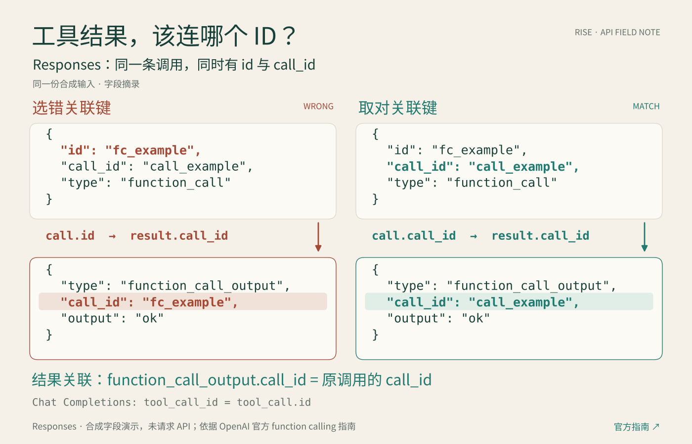

# RISE — 递归自我涨粉

<p align="center"></p>

<p align="center"><a href="references/algorithm.md"></a> <a href="public/metrics.json"></a> <a href="LICENSE"></a></p>

<p align="center"><b>Recursive Iterative Social Expansion</b><br/>X 自动涨粉与高质量增长技能<br/><a href="README.md">简体中文</a> · <a href="README.en.md">English</a></p>

## 递归自我涨粉，是整个项目的核心

**X 展示真实成果 → GitHub 开源可用技能 → 用户使用、反馈与 PR → 更新实测数据 → X 分享新的有价值结果 → 再次传播。**

每轮传播引用下一层证据：X 帖子链接本仓库；本仓库展示该帖的真实曝光、回复、点赞与收藏。热度是传播反馈，不是单独证明涨粉因果的证据。循环不等于无限刷屏；没有新价值或新数据就不重复推广。

**本技能基于 X 开源推荐算法 [xai-org/x-algorithm](https://github.com/xai-org/x-algorithm)。** 用「行动 → 观察 → 反馈 → 调整」同时优化新增蓝 V 数量与高质量占比，争取增长和长期交流。支持浏览器行动、离线测量、个人 fork 与共同迭代。不是 X 官方产品，不保证指数增长。

## 从开源算法得到的五条行动结论


1. [先找相关受众](references/algorithm-field-guide.md#1-先找到相关受众再看互动数字)：单向关注首先改变自己的召回，不等于自己的曝光增加。
2. [保持专业主线](references/algorithm-field-guide.md#2-内容主线要和目标观看者匹配)：围绕 AI 开发、独立产品与真实案例交流；标签没有已知固定加权。
3. [置顶更新与原创分开](references/algorithm-field-guide.md#3-持续更新置顶同时区分更新与新内容)：同会话在 Home 可能被合并或过滤，新发现才写独立原创。
4. [每篇增加实际信息](references/algorithm-field-guide.md#4-保持主题一致让每篇确实增加信息)：作者多样性按候选池处理；DPP 还有启动和请求两道门，线上是否开启未知。
5. [优化真实新增与质量](references/algorithm-field-guide.md#5-优化真实目标不制造算法得分)：权重乘预测量，自己的操作数不能换算成推荐得分。

[30 个文件的来源绑定](references/upstream.json) 固定到官方提交 `78460ca8b65c57ddd3a05f9217c8aaeba214b628`；这不是完整源码审计或线上配置证明。[具体执行条件](references/algorithm.md)。以上策略仍需账号实验验证。

## 真实实验记录

**当前挑战：真实总粉丝破 10 万。** 250 → 1,000 → 10,000 → 100,001 是复盘检查点；高质量蓝 V 仍需独立核验。到达日期未知。[阶段迭代方法](references/road-to-100k.md)。

**新增运营目标：提高原创内容的认证首页展示，达到 90 天 50 万门槛。** 同时保留新增蓝 V 数量与高质量占比目标。评论展示排除；资格展示与收益合格展示分开。[当前 X 官方规则](https://help.x.com/en/using-x/original-content-rewards)。


后台最新实际采集 **2026-10-08 07:58:18.986 UTC**：近 90 天、排除回复的认证首页展示仍为 **534 / 500,000（0.1068%）**，还差 **499,466**；认证粉丝 **177 / 500（35.4%）**，还差 **323**。认证粉丝是平台后台口径，不是已核验的蓝 V 或高质量人数。[真实门槛计数](public/reward-observations.json)。

首读 **04:02:12.455 UTC** 为 534 展示、167 认证粉丝；随后 **05:28:49.830、06:16:15.225、07:08:35.839 UTC** 的认证粉丝分别为 **171、176、177**。第五次较第四次相隔 **49.72 分钟**，两项净变化均为 **0**；首末认证粉丝累计净变化 **+10**，五个时点的滚动展示均为 534。滚动净变化 0 不证明这期间新入展示为 0，后台刷新与到期扣除也未分开测得。这些读数不能证明获客因果或收益资格；预测与合格收益计数仍未知。[同口径滚动进度](public/reward-progress.json)。

模型新增目标为单帖未来 1 小时／24 小时的认证首页展示增量；目前缺该口径的逐帖标签，预测仍为未知，不用总 views 乘认证比例代替。账户 90 天进度还需扣除到期展示。官方将自动创作或发布的内容列为收益不合格；Codex 代发实验不作为合格收益证明，真人原创、人工发布与研究统计分别记录。[目标、内容策略与预测边界](references/reward-reach.md)。


<!-- RISE:METRICS:START -->
| 真实观察 | 当前结果 |
| --- | --- |
| 总粉丝 | 175 → 297，净变化 **+122** |
| 新观察到的蓝 V | **24** 个；精确新增粉丝未确认 |
| 质量分类 | 2 确认高质 / 2 未匹配主题 / 20 待判定 |
| 高质量占比 | 分类尚未完成，不能把未知当 0% |
| 当前观察队列窗口 | 2026-10-08T00:23:58.426Z → 2026-10-08T05:14:58.325Z |
| 最新账号采集 | 2026-10-08T18:27:35.750Z |
| 粉丝名单采集覆盖 | 已采集 273/276；名单不完整 |
| 全窗口高质量占比 | 未知；粉丝名单不完整 |
| 上一独立观察队列 | 2 高质 / 3 未匹配 / 0 待判定（n=5） |
| 观察队列质量：已确认下界 / 可能上界 | 8.3%–91.7% |
| 首次账号采集 | Timestamp unavailable |
| 较早蓝 V 计数采集（独立窗口） | 2026-10-07T21:04:50.311Z |
| GitHub stars / forks | 1 / 0 · 2026-10-08T13:26:50.943894+00:00 |

上下界描述观察到的蓝 V 队列，并非已确认新增粉丝；无法排除认证升级及改名。公开互动计数可能包含账号自身操作。

[RISE launch post](https://x.com/LIghtJUNction_x/status/2107943767382847844)

[置顶帖下的最新进展](https://x.com/LIghtJUNction_x/status/2108241779099340888)
<!-- RISE:METRICS:END -->

完整原始聚合记录：[public/metrics.json](public/metrics.json)。首次总粉丝检查没有保留精确时间；同期有其他账号活动，且首轮数据早于技能完成。**总粉丝净变化不等于蓝 V 新增，认证名单新增不一定是新关注。此前部分名单的 24 人观察队列仍为 2 高质、2 未匹配、20 未知（4/24 已评审）。历史 5 人队列已完成质量复查；较早 12 人队列仍有 1 人未知，各队列独立保留。** 未知与名单缺口不转成增长效果。

同一 24 人队列在 `2026-10-08T05:31:52.616487+00:00` 完成前三项评审时为 **1 高质 / 2 未匹配 / 21 未知**；`2026-10-08T05:56:28.390889+00:00` 的第四项复查将一项未知改为高质，现为 **2 / 2 / 20**。捕获子样本下界为 **2/24 = 8.333%**，可能上界为 **22/24 = 91.667%**。这是未知减少，不是新关注、涨粉或因果提升；该次名单覆盖为 **273/276 partial**，139 个旧身份的认证状态更新未算新增。原三项评审的证据采集时钟仍不完整，新增复查自己的完整时钟不会补齐旧证据；确认新增及全窗口质量比例仍未知。

另一次名单采集为 **06:49:14.446 → 06:55:06.584 UTC**，在 **06:56:00.877 UTC** 核对主页，覆盖 **279/282**，仍不完整。相较 **05:14:58.325 UTC** 的名单，当时观察到 **6 个蓝 V 事件**；原始冻结批次保留 **0 高质 / 0 未匹配 / 6 未知**。这是两次名单间的部分观察，不是“自上一轮行动后新增 6 人”；精确新增蓝 V 与全窗口高质比例仍未知，旧回关不重复计数。

**2026-10-08 09:14:36.227350 UTC** 单独进行的后续复查为 **1 高质 / 0 未匹配 / 5 未知**，已评审 **1/6**；这六个观察事件子样本的占比下界为 **16.7%**，可能上界为 **100%**。这只补齐质量标签，不计新增粉丝或高质增长，也不并入原 24／5／12 人队列。实质性证据仅为一条具体排查的作者自述；效果、新闻主张与是否真人创作均未核验。完整新增与全窗口质量比例仍未知。

较早实测：[算法聚焦轮](public/backtests/2026-10-08-algorithm.md) 记录 **270 粉丝**（02:49:34 UTC），较旧 256 净增 14；同期有其他视频和关注操作，无法逐帖归因。定向 Git 建议 10 浏览@73.89 分钟，Harness 建议 9 浏览@59.93 分钟，来源请求 20 浏览@63.66 分钟；后一帖的 1 条回复只是同一作者提供下载入口。两条技术建议均未观察到技术回应或主页访问，尚未证明新增高质获客。

可直接复现的资料：[AI 代码验收的三种 Git 状态](references/ai-code-review-case.md)，双语说明与真实命令输出。


四文件合成实验：[重试后的分镜排序](examples/panel_order_demo.py)。运行 `python examples/panel_order_demo.py`：修改时间排序从 `1→2→3→4` 变为 `1→3→4→2`，固定分镜编号仍为 `1→2→3→4`。使用占位 `.txt` 和显式模拟时间，只演示排序逻辑，不作为产品故障或真实漫画生成的证据。

已于 **2026-10-08 12:18:21 UTC** 发布[带图原创帖](https://x.com/LIghtJUNction_x/status/2108170130702344695)，引用本仓库复现脚本。真实计数按各自观察时刻记录在[公开数据](public/metrics.json)；发布本身不证明涨粉效果。


[API 字段原创](https://x.com/LIghtJUNction_x/status/2108251776344625405)于 **2026-10-08 17:42:47 UTC** 发布，**17:44:09.271 UTC** 重开核对正文、图、ALT 和来源，首读 **1 浏览、0 回复／转帖／点赞／收藏**。按 [OpenAI 官方指南](https://developers.openai.com/api/docs/guides/function-calling)，Responses 的结果关联原调用 `call_id`；图为合成字段示范，未请求 API。已观察到 **1 条外部主题相关确认**（**17:45:54 UTC** 发布、**17:56:16.558 UTC** 观察，原生父链已核验），没有方法采用或完成测试的证据；当前互关不计新增粉丝。[幂等错误重放回复](https://x.com/LIghtJUNction_x/status/2108247991186534610)已于 **17:27:45 UTC** 发布，**17:28:47.637 UTC** 首读 **1 浏览、其余可见互动 0**；临近 60 分钟目标 **18:27:45 UTC** 的实读为 **18:27:52.232 UTC、10 公开浏览、其余可见互动 0**，迟 **7.232 秒**。单独后台 **18:28:12.655 UTC** 读到 **9 普通展示／4 互动／4 详情／0 主页／0 链接点击**，迟 **27.655 秒**，不与公开浏览合并。该回复未预设迟到预算，精确 60 分钟值未知；其 24 小时及 API 原创的 60 分钟／24 小时观察仍待完成，无调度。自己的嵌套方法回复是 API 原创后续计数的混杂因素，单列记录，不计独立外部回应。

[三字段日志与结果来源边界的补充回复](https://x.com/LIghtJUNction_x/status/2108260868630950040)于 **2026-10-08 18:18:55 UTC** 发布，**18:20:04.434 UTC** 首核 **1 浏览、其余可见互动 0**；这是沿已有确认继续给帮助，不是新外部反馈、独立扩散或采用证据。动作预算为 **0 原创／1 回复／0 点赞、转帖、关注**；此前 **18:16:18.839 UTC** 基线 **297 粉丝／290 关注／606 帖**，与 17:44 窗口粉丝净变化 0，操作后 **18:27:35.750 UTC** 为 **297／290／607**，较基线粉丝净变化 **0**，新增蓝 V 与高质新增仍未知。该回复 **60 分钟目标 19:18:55 UTC、24 小时目标 2026-10-09 18:18:55 UTC** 均待观察，无调度；预先声明的迟到 **90 秒**仅适用于这条新回复，不追补到前两帖。



## X × GitHub：互相引用的反馈循环


示例来自真实发布内容，仅保留本轮浏览器核验仍可访问的链接；不可访问的示例已移除，历史观察继续保留。[链接可访问性核验](public/post-availability.json)。

- [收到主题确认后的方法补充：日志与结果出处](https://x.com/LIghtJUNction_x/status/2108260868630950040)
- [Responses 工具结果：同一调用的两个 ID，该关联哪个？](https://x.com/LIghtJUNction_x/status/2108251776344625405)
- [回应重试讨论：幂等请求也有错误重放边界](https://x.com/LIghtJUNction_x/status/2108247991186534610)
- [预测区间反例：126 个零新增样本全部漏出区间](https://x.com/LIghtJUNction_x/status/2108240460431134796)
- [回应配音接缝问题：固定分段、盲听与费用记录](https://x.com/LIghtJUNction_x/status/2108090442583851205)
- [真实失败回测：小模型暂未胜过同窗简单基线](https://x.com/LIghtJUNction_x/status/2108064574675247167)
- [回应开发者反馈：复现入口、排除证据与修改理由](https://x.com/LIghtJUNction_x/status/2108060803639500970)
- [回应短片实验：重复任务并保留失败、耗时和费用](https://x.com/LIghtJUNction_x/status/2108067265497485702)
- [算法独立原创：关注方向与置顶会话过滤](https://x.com/LIghtJUNction_x/status/2108028923200339985)
- [交付给原作者的关键帧与样片](https://x.com/LIghtJUNction_x/status/2108025662980358354)
- [相关 Harness 训练讨论：本地与远程对照建议](https://x.com/LIghtJUNction_x/status/2108011337209270512)
- [针对真实多模型审查命令：diff 范围遗漏的复现建议](https://x.com/LIghtJUNction_x/status/2108007419154735157)
- [回应遮挡标注追问：CVAT 官方资料与复核记录](https://x.com/LIghtJUNction_x/status/2108004713065230723)
- [AI 文案改写：逐句指回事实](https://x.com/LIghtJUNction_x/status/2108000829303378383)
- [收到真人反馈后的延续交流](https://x.com/LIghtJUNction_x/status/2107995153403465983)
- [数据标注讨论：固定验证样本](https://x.com/LIghtJUNction_x/status/2107976452662817134)
- [调试讨论：新会话的五项交接信息](https://x.com/LIghtJUNction_x/status/2107977004314431778)
- [首轮 Codex 提示词实验](https://x.com/LIghtJUNction_x/status/2107934424151335154)
- [AI 编程回复：git diff 会漏掉什么](https://x.com/LIghtJUNction_x/status/2107936031907737758)
- [创作者收益讨论：如何衡量粉丝质量](https://x.com/LIghtJUNction_x/status/2107936390185193718)
- [回应 AI 视频创作者：口播一致性的对照测试](https://x.com/LIghtJUNction_x/status/2107947524829127073)

X 介绍帖作为固定入口：有新实测或实际改进时优先更新原置顶帖；无法编辑时在原帖下追加带时间戳的进展回复。

GitHub stars/forks 每 6 小时通过 GitHub Actions 更新；X 热度和粉丝数据仅在实际浏览器复查后更新，不将 GitHub 刷新时间冒充 X 数据采集时间。README 同步生成图表，保留历史观察。没有配置无人值守 X 调度器。

公开互动计数可能包含账号自身点赞或进展回复，不能将自互动当作独立受众认可。

已完成的旧窗口：[矩阵 12 浏览@60.11 分钟](public/backtests/2026-10-08-matrix.md)、[技术案例 15 浏览@60.38 分钟及 1 位具体回应作者](public/backtests/2026-10-08-technical-case.md)、[方法帖 34 浏览@67.15 分钟](public/backtests/2026-10-08.md)。矩阵与技术案例的原帖目前不可访问，以上本地证据保留当时观察。帖子年龄、版本和同时发生的操作不同，不能当作公平对照；旧时间和名单分母均保留在各轮记录。

此前已将 [8 张粗框关键帧](https://x.com/LIghtJUNction_x/status/2108022019157873061) 与 [12 秒样片视频](https://x.com/LIghtJUNction_x/status/2108025662980358354) 实际交付给提出问题的作者；商品去向留未知，视频连续观看审核仍待完成。[Luna API 回复](https://x.com/LIghtJUNction_x/status/2108016718492909780) 是未实测建议。这是一位作者的持续交流，不能按消息数算新增作者或粉丝。

[算法独立原创](https://x.com/LIghtJUNction_x/status/2108028923200339985) 已于 **02:57:15 UTC** 发布，图片、ALT 和源码链接均重开核对；首核 2 浏览、互动均 0，属于早期读数。60 分钟实际复查 **03:57:42.584 UTC**（晚 27.584 秒）：33 浏览、0 外部回复、1 次可见自赞；独立点赞为 0。24 小时点为次日 **02:57:15 UTC**，仍待观察，不能当成公平 A/B。

五人观察队列的 40% 不变；旧不完整名单中的两个高质事件、指定对象质量复查和前一阶段两次蓝 V 回关分别保留。两位历史回关对象尚未完成质量核验，不报确证新增。没有配置后台 X 检查。较早覆盖边界迭代通过 118 项测试；历史源码与参数复核通过 **124 项测试**。部分名单披露、真实反馈与独立认证首页目标更新曾通过 **226 项测试**；冻结预测评价器与当时真实计数迭代通过 **242 项测试**。该历史阶段通过 **255 项测试**，其中文案来源目标相关 **41 项**；当时来源分类器与认证首页展示目标尚未训练。

前一交流阶段实际完成 **4 条实质回复、1 次收到反馈后的点赞、1 次相关蓝 V 关注**。当时收到一位作者对固定模型的澄清与同作者点赞，另一位作者建议按独立帖子划分验证样本；不按消息数重复计作者。当时新关注对象尚未分类，回关尚未确认，未算获粉。

较早交流窗口实际完成 **1 条原创主帖、1 条实质回复、1 次已重开确认的蓝 V 回关**，点赞、转帖均为 **0**。回关对象在操作前已关注本账号，质量仍未知，不算新增获客。配音作者明确了“分段拼接像换了人”的问题，并[表示本周计划跑对照](https://x.com/clyve2022/status/2108083085367714123)，尚未交付测试结果。[新回复](https://x.com/LIghtJUNction_x/status/2108090442583851205)于 **07:01:42 UTC** 发布，建议固定文案和分段点、盲听接缝，同时保留费用与重生成次数；**07:03:11.738 UTC** 首核为 **1 次公开浏览、0 回复／点赞／转帖／收藏**，随后 **07:20:38.398 UTC** 读到 **12 次公开浏览**，其他互动仍为 0。这是早期随访，不是 60 分钟结果，也不能证明增长效果。

[严格声明组验收原创主帖的历史记录](public/metrics.json)于 **2026-10-08 07:22:07 UTC** 记录实际发布，已披露 Codex 代发；[本轮核验](public/post-availability.json)原帖目前不可访问。它介绍已完成的声明组验收与 255 项测试；[源码版本 `84adb04`](https://github.com/LIghtJUNction/x-quality-growth/commit/84adb04)的 [CI 运行 `37742589450`](https://github.com/LIghtJUNction/x-quality-growth/actions/runs/37742589450)已核验成功。当时来源分类器与认证首页预测模型仍未训练。**07:24:20.681 UTC** 重开全文首核为 **1 次公开浏览、0 回复／转帖／点赞／收藏**；固定 60 分钟目标 **08:22:07 UTC** 已记录[延迟代理结果](public/forecasts/rise-2108095581906428165-60m.evaluation.json)：**08:24:17.712 UTC** 读到 **9 次公开浏览**，迟到 **130.712 秒**，精确 60 分钟真值仍未知。未配置无人值守 X 调度器。首读是发布验证，不是涨粉或预测效果证明。

另一个定向选取、持续交流的蓝 V 对象在 **07:08:07.479 UTC** 被观察到 Following 和 Follows you；**07:12:22.839288 UTC** 的独立质量审查按既定公开内容标准判为高质，依据三篇完整近期方法正文及同一作者的两条实质回应。关系状态未用于质量判定，关注起始时间与因果获客仍未知；这项独立审查不加入旧 24 人或新 6 人队列，也不重复算本轮关注操作。

## 统计与预测：用真实误差检验模型


该历史窗口的主页读数为 **283 粉丝 / 276 关注**（2026-10-08 **09:18:36.699 UTC**），较本轮起点 **08:58:07.735 UTC** 的 **282 / 274** 总粉丝净变化 **+1**；精确新增蓝 V 与高质获客仍未知。

本轮完成 **1 次已保存的蓝 V 回关、1 次相关蓝 V 作者关注、1 条[实质回复](https://x.com/LIghtJUNction_x/status/2108123887909376093)**；回复于 **09:14:36 UTC** 发布，**09:16:57.527 UTC** 首读为 **2 次浏览、0 回复／点赞／转帖／收藏**。**09:27:46.641 UTC** 的早期随访为 **9 浏览、1 点赞、0 回复／转帖／收藏**，**09:26:09.710 UTC** 的通知将点赞归属原讨论作者（非自赞）；尚无方法回应、采纳、完成测试或获客证据。同期可见五条技术视频，其中两条在本轮新增，属于其他任务的发布，不计入上述动作；总粉丝净变化无法归因于本轮互动。

旧回关窗口 **07:59:32.891 → 08:09:38.594 UTC** 的主页仍记录为 **282 / 271 → 282 / 272**：一次既有蓝 V 粉丝回关已重开验证，总粉丝 **282 → 282，净变化 0**，关注数增加 1；不算新增粉丝或质量提升。旧读数 **08:35:09.886 UTC** 为 **281 / 272**，较 08:09 总粉丝净变化 **−1**，不能确证蓝 V 流失。首次 175 至当时 283 的累计净变化为 **+108**，首次时间缺失，且同期有其他活动，不算本轮增长或速度，也无法归因给技能。五人观察队列的 **40%** 仍是原队列质量，不是全账号高质占比或确证新增质量率。

速度用 `Δ粉丝 / Δ时间`；加速度用两段速度之差除以**两窗口中点的时间差**，单位分别为人/小时与人/小时²。这些差分描述净变化，不能分离新增与取关，也不证明增长机制。单帖展示、互动、详情、主页访问和点击按来源及采集时间分别统计；公开浏览与 owner impressions 不混算，缺少归因的单帖获粉仍为 null。


**已完成真实计数拟合，当前曲线尚未优于简单基线。** PyTorch 2.14 CPU 单线程训练了两个分别拟合的单帖曲线，每个仅 3 个参数；最终参数存档共用 19 个相关观察点，不是 19 条独立帖子。置顶帖有 7 个可评估的滚动预测起点，预测时只使用截至该起点可得的数据。

最新历史留出窗口为 **03:08:12.506 → 03:23:30.786 UTC**，约 15.30 分钟，实际 **661 浏览**。这是下一点历史回测，不是提前发布的预测；该次预测只用了此前 12 点，最终存档随后再拟合到包含留出点的可用历史。

| 模型 | 最新留出预测 | 绝对误差（浏览） | 同窗回测 MAE（浏览） |
| --- | ---: | ---: | ---: |
| 保持最后值 | 659 | 2 | **9.40** |
| 延续最近速度 | 668.85395 | 7.85395 | 12.30 |
| PyTorch 三参数曲线 | 673.22592 | 12.22592 | 28.30 |

MAE 是平均绝对误差，越低越好。最后一列只比较**同一置顶帖、相同 5 个起点与目标、15–60 分钟跨度**；这些样本相关，不能宣称跨帖泛化或统计胜出。24 小时外推尚无真实结果，误差区间未知；曝光预测也不能换算成蓝 V 新增或十万粉到达日期。

**首次提前冻结的基线实验已得到真实结果：** 新回测帖在 `05:49:55.484 UTC` 为 14 次公开浏览；对发布后 60 分钟（`06:18:55 UTC`）的预测为最后值 **14**、近期增速 **27.7904**。预测在 `05:52:29 UTC` 冻结，并在目标之前[提交到 GitHub](https://github.com/LIghtJUNction/x-quality-growth/commit/e792e3771668e3f4945a0b90f257eb84a5a44bfa)。首次成功数字采集为 `06:19:28.906 UTC`、**26 浏览**，实际年龄 **60 分 33.906 秒**；精确 60 分钟计数未知，使用预先声明的延迟观察代理。两项单次绝对误差为 **12 / 1.79036**，仅 **1 帖、1 个未来目标**，不能证明近期增速稳定胜出。[冻结文件](public/forecasts/rise-2108064574675247167-60m.json)保持不变，[真实评价](public/forecasts/rise-2108064574675247167-60m.evaluation.json)另存。这里是从帖子约 31 分钟预测到 60 分钟，**不是再预测未来一小时**；旧 PyTorch 未参加，没有训练新模型，也不预测认证首页展示。[冻结、真实时钟与评价方法](references/prospective-prediction.md)。


**第二帖已观察到迟到结果：9 次公开浏览。** [第二份冻结记录](public/forecasts/rise-2108095581906428165-60m.json)在 **07:51:59 UTC** 封存，对发布后 60 分钟（**08:22:07 UTC**）的公开浏览预测为最后值 **3**、近期增速 **6.1998386**；延迟观察上限为 **08:27:07 UTC**。[GitHub 提交 `8325e05`](https://github.com/LIghtJUNction/x-quality-growth/commit/8325e05)的提交时间为 **07:57:50 UTC**，[成功 CI](https://github.com/LIghtJUNction/x-quality-growth/actions/runs/37746720556)由服务端于 **07:57:56 UTC** 创建，证明目标前已有公开记录。

首次读取在 **08:22:44.363 UTC** 仍为 Loading，保留为 `null`，不是 0。首次成功读数是 **08:24:17.712 UTC 的 9 次公开浏览**，帖龄 **62 分 10.712 秒**，比目标迟 **130.712 秒**；处于事先声明的 **300 秒**窗口内，仅作为延迟代理，精确 60 分钟真值仍为 `null`。[评估记录](public/forecasts/rise-2108095581906428165-60m.evaluation.json)中本次绝对误差为最后值 **6**、近期增速 **2.80016**。两个不同原生帖的目标记录不证明样本相互独立或稳定胜出；旧 PyTorch 不参与本次比较，没有新模型训练或认证首页展示预测。

**第三帖的 60 分钟目标也保留了提前冻结与迟到实测。** [冻结记录](public/forecasts/rise-2108170130702344695-60m.json)封存于 **2026-10-08 12:46:17.843559 UTC**，对 **13:18:21 UTC** 的公开浏览预测为最后值 **15**、近期增速 **69.19827**。首次目标读取 **13:19:08.281 UTC** 为 Loading，仍记 `null`；首次成功读数 **13:19:39.278 UTC** 为 **91 浏览**，实际帖龄 **61 分 18.278 秒**、迟 **78.278 秒**，处于预先声明的 **90 秒**窗口内。[单次绝对误差](public/forecasts/rise-2108170130702344695-60m.evaluation.json)为 **76 / 21.80173**；精确 60 分钟真值未知，冻结文件不改。这仅是一个目标的延迟代理，近期速率来自约 86 秒的短窗口，操作员重开与异步计数可能影响结果；不证明稳定优越、认证首页展示或获粉，旧 PyTorch 和来源分类器未参加。

**新完成的历史转帖实验：SEISMIC retweet-v2。** 于 **2026-10-08 10:29:36.524651 UTC** 完成，使用单 CPU 线程训练两个小型 MLP，每档 **241 个参数，共 482 个**。分别从帖龄 **15 分钟／60 分钟**预测**截止后至帖龄 24 小时的新增转帖**，不是 views、下一小时浏览或认证首页展示。五项输入仅为截止前计数的 `log1p`、首末转帖时间比例、截止时零转帖标记和截止时间比例，不使用未来事件或正文。


最终数据为 **165,929 个规范、未重复源帖级联，331,858 条成对窗口行**。每档外层按时间划分为 **59,565 训练／12,193 标签成熟重叠隔离／94,171 测试**；同一帖的两档留在同一划分，不算两份独立样本。只在外层训练内按时间做 **23,779 拟合／11,964 隔离／23,822 验证**，选择训练轮数为 **15 分钟 14 轮、60 分钟 10 轮**，再用完整外层训练重拟合；测试只评估 **一次**。

| 模型 | 15 分钟截止 MAE（新增转帖） | 60 分钟截止 MAE（新增转帖） |
| --- | ---: | ---: |
| 零新增：保持截止计数 | 109.18 | 76.34 |
| 训练目标中位数常量 | 77.85 | 59.33 |
| 延续早期恒定速率 | 7,000.12 | 2,402.23 |
| 训练计数分桶中位数 | 63.18 | 47.08 |
| 小型 MLP | **60.40** | **45.71** |

每列为同档 **94,171 个后续测试级联**的平均绝对误差。相比分桶基线，MLP 的总体 MAE 下降 **4.41%／2.90%**，仅为这次测试的描述差异，置信区间与统计优越性未知。[公开聚合结果](public/retweet-benchmark.json)。旧两帖、19 个相关观察点的浏览曲线及其 **28.30 对 9.40** 的失败回测仍独立保留，不能合并这两种指标或模型。

**模型并非全面胜出。** 15 分钟截止时零转帖子组 **n=881**：MLP MAE **61.98825**，比分桶 **61.72304** 更差；60 分钟全测试的 p90 绝对误差为 **105.18341 对 105.00000**，也更差。源数据为 **2011 年英文、无 hashtag、按未来成功转帖筛选**；作者、重复正文与热点分组未知，数据许可也未核清。这不是当前账号的 views 或涨粉验证；认证首页预测仍未训练，也没有证明跨语言迁移或普遍优越。[数据、划分与限制](references/data-reuse.md)。


新模型已另行发布到 [Hugging Face / RISE-retweet-baseline](https://huggingface.co/LIghtJUNction/RISE-retweet-baseline)，固定版本 `1282fc5e88e64073bf680b0dda21663f19b73c69`。**2026-10-08 10:55:16.800135 UTC** 已匿名下载核对全部 7 文件 SHA，并实跑标准库合成推理；两档权重与归一化器和训练冻结数值完全一致。原始来源与逐行预测没有上传。[发布核验](public/hf-retweet-release.json) · [准备及训练复现步骤](references/data-reuse.md#复现准备与训练)。

[本次模型结果分享](https://x.com/LIghtJUNction_x/status/2108155423509696529)已接在固定置顶会话下，展示真实回测图、HF 与 GitHub 入口，并披露 Codex 代发。实际首发 **2026-10-08 11:19:55 UTC**，独立重开 **11:22:55.423 UTC** 时为 **1 次公开浏览、0 回复／转帖／点赞／收藏**；这是发布核验，不是独立受众、模型被采用或涨粉效果。已记录迟到 60 分钟观察：**12:21:06.334 UTC** 为 **25 次公开浏览、0 回复／转帖／点赞／收藏**，实际帖龄 **61 分 11.334 秒**，精确 60 分钟值仍未知。独立后台读取 **12:21:37.577 UTC** 为 **24 次普通展示、1 次互动、1 次详情展开、0 主页访问**，链接点击未知；两种计数不合并。24 小时随访待观察，没有后台调度。

**新增转帖预测区间：已训练并发布，尚无新最终测试。** 于 **2026-10-08 16:03:15.690653 UTC** 完成的分位数模型每档 **259 个参数**，仍使用上述五项时间与计数特征、同一历史数据。内层 **23,779 拟合／11,964 隔离／23,822 验证**；模型与训练轮数均由这份验证集选择，未读取最终测试标签，也未新增样本。[聚合结果](public/retweet-validation.json)。


| 截止帖龄 | 原点模型 → 分位数中位数 MAE | 名义 80% 区间实测覆盖率 | 平均区间宽度（新增转帖） |
| --- | ---: | ---: | ---: |
| 15 分钟 | 61.72927 → **60.37052** | 86.8231% | 216.278 |
| 60 分钟 | 45.35910 → **45.05648** | 90.2401% | 165.085 |

**区间很宽，子组覆盖失败必须保留：** 15 分钟档的“截止后至 24 小时新增转帖为零”子组 **n=126、覆盖率 0%**；60 分钟同类子组 **n=352、覆盖率 100%**。总体覆盖高于名义 80% 不证明校准有效；这些是参与模型选择的验证结果，不能和旧最终测试混算，也不证明当前 X 浏览、认证首页展示或获粉效果。

分位数模型已发布到 [Hugging Face / RISE-retweet-quantiles 固定版本](https://huggingface.co/LIghtJUNction/RISE-retweet-quantiles/tree/2a72cfa931dafdd3c0a630aa71a5e333ec4c053c)，revision `2a72cfa931dafdd3c0a630aa71a5e333ec4c053c`。**2026-10-08 16:24:19.413543 UTC** 已匿名下载核对六个发布文件的 HTTP 200 与 SHA，并实跑六项标准库合成推理，退出码 0，非负有限且分位数有序；完整文件树仅这些文件与 `.gitattributes`。[发布核验](public/retweet-quantiles-release.json)。这证明公开复现可运行，合成输入不构成预测效果、当前账号迁移或流量恢复验证。

**内容实验：从具体失败问题开头。** [带真实图的独立原创](https://x.com/LIghtJUNction_x/status/2108240460431134796)于 **2026-10-08 16:57:49 UTC** 发布并重开核对，用“整体覆盖 86.8%，126 个零新增样本一个没罩”介绍上方 15 分钟区间反例，附中文 ALT；结果仍限 2011 数据的内部验证。**17:06:59.517 UTC** 早期读数为 **10 次公开浏览、1 次转帖、0 回复／点赞／收藏**，不是 60 分钟结果；**17:35:09.255 UTC** 中途读数为 **27 浏览、1 转帖计数**，**17:36:16.271 UTC** 活动明细确认了本账号进展回复的引用，普通转帖页显示“暂无转帖”，但作者覆盖完整性未知，因此此前 1 不能作为外部传播证据。独立作者、因果效果、新增蓝 V 和高质新增均未知。

[固定置顶会话的进展回复](https://x.com/LIghtJUNction_x/status/2108241779099340888)于 **17:03:04 UTC** 追加，原置顶入口保留；**17:04:59.264 UTC** 重开为 **1 次公开浏览、0 回复／转帖／点赞／收藏**。原创的 60 分钟目标为 **2026-10-08 17:57:49 UTC**，临近目标实读 **17:58:04.935 UTC 为 39 次公开浏览**，迟 **15.935 秒**；未预设迟到预算，精确 60 分钟值未知，不当作预设窗口合格结果。独立后台读取 **17:58:59.824 UTC** 为 **38 次普通展示、3 次详情展开、0 主页访问**，不与公开浏览合并。**24 小时目标为 2026-10-09 16:57:49 UTC**，仍待观察，未安排后台检查。

浏览曲线与转帖热度模型都只使用时间、计数及其派生特征，实测平台范围仍限于 X／历史 Twitter；下方来源分类是另一个研究任务，没有作为热度输入。统一的正文、图片、视频、评论输入契约已设计，媒体语义尚未进入训练，其他平台适配尚未验证。官方热门池参考分也不是未来曝光预测。[统计方法](references/growth-statistics.md) · [输入契约](references/model-inputs.md) · [官方时间参数](references/algorithm-time.md) · [推荐公式与边界](references/recommendation-formulas.md)

**文案来源研究基线已本地训练：HC3 中文开放问答二分类。** 于 **2026-10-08 16:07:41.421724 UTC** 完成，任务只区分数据集标注的人类回答与早期 ChatGPT 回答，混写未训练。[1,683 条测试回答的聚合评价](public/authorship-benchmark.json)中，强制每条给二分类的基准准确率为 **95.37%**，长度基线为 **73.56%**。这是按关联组留出的问答实验，来源创作时间未知，不是时间留出，也未证明真实作者独立或适用于当前模型与 X 短帖。

**允许推理的子集表现更差：** 仅 **210 / 1,683（12.48%）** 满足限定的长中文、显式 HC3 域条件；其标签为 **205 条 AI／5 条人类**。模型准确率 **87.14%**，低于该子集“全判 AI”的 **97.62%**。因此不能把总体 95.37% 当成实际使用效果；默认 X 输入返回 **`unknown` 与空概率**，不判定作者身份，不输出虚构混写概率，也不用于质量评级或获粉决策。

研究基线已发布到 [Hugging Face / RISE-HC3-source-baseline 固定版本](https://huggingface.co/LIghtJUNction/RISE-HC3-source-baseline/tree/ae590ac0e4eb16ff810bf5b651480be2b938c348)，revision `ae590ac0e4eb16ff810bf5b651480be2b938c348`。**2026-10-08 16:32:26.892800 UTC** 已匿名下载核对八个发布文件的 HTTP 200 与 SHA，完整文件树仅这些文件与 `.gitattributes`；合成推理退出码 0，默认 X 输入保留未知，显式 HC3 二分类概率和为 1，三分类请求仍返回未知。[发布核验](public/authorship-release.json)。这些检查验证公开代码可运行及拒绝域外输入，不证明真实 X 来源检测、作者身份或获粉效果。

[输入与概率校验器](scripts/authorship.py)已实现；跨帖模式核对原平台身份与声明的内容分组重叠：X 使用 `x` 和规范数字帖 ID，编辑、共用材料及同一具体事件应留在同组。校验不能独立证明声明的分组与来源正确。认证首页展示模型仍未训练，没有来源特征改善热度的实测；来源概率不代表质量，也不是正文中 AI 字符的比例。[来源、标签和验证规则](references/model-inputs.md) · [现有资源复用](references/data-reuse.md)。

复现三份聚合结果；前两项只需 Python 标准库，曲线训练另需 PyTorch：

```sh
python3 scripts/growth_dynamics.py --output public/growth-dynamics.json
python3 scripts/post_statistics.py --output public/post-statistics.json
python3 scripts/predict_heat.py --model torch --output public/heat-prediction.json --model-outputpath runs/heat-model-state.json
python3 scripts/reward_progress.py --outputpath public/reward-progress.json
```

[粉丝差分结果](public/growth-dynamics.json) · [单帖统计](public/post-statistics.json) · [预测回测](public/heat-prediction.json)。模型、复现代码及真实回测已发布到 [Hugging Face / RISE-heat-baseline](https://huggingface.co/LIghtJUNction/RISE-heat-baseline)，固定版本 `ab23b84bfe1a46f8b9b8b604f200461d59ba6ca9`；公开下载的参数和模型说明与本地 SHA-256 一致。用 Hugging Face CLI 下载此版本后可复现：

```sh
hf download LIghtJUNction/RISE-heat-baseline inference.py model-state.json --revision ab23b84bfe1a46f8b9b8b604f200461d59ba6ca9 --local-dir rise-heat-replay
cd rise-heat-replay
python inference.py --state model-state.json --post-id 2107943767382847844 --age-seconds 25200
```

匿名下载实跑输出 `curve_value: 806.4055879746555`。它读取已有帖在帖龄 25,200 秒处的归档拟合曲线；推理仅需 Python 标准库，无需 PyTorch 或 GPU。新帖需重新拟合，文案与媒体尚未作为输入。同一帖的 5 个匹配回测点上，模型 MAE 为 **28.30**，最后值基线为 **9.40**；模型误差更大。

[X 复现教程的历史记录](public/post-statistics.json)保留其对[真实回测图帖](https://x.com/LIghtJUNction_x/status/2108064574675247167)的引用、HF 入口与 Codex 代发披露；[本轮核验](public/post-availability.json)教程原帖目前不可访问。它于 **08:33:46 UTC** 首发、**08:43:46 UTC** 修正脚本名的显示，计 **1 次发布、1 次编辑**；编辑不重置帖龄，也不增加独立样本。当时最新版本已重开核对，首核 **2 次浏览、0 回复／转帖／点赞／收藏**。

60 分钟随访已取得实际迟到读数：**2026-10-08 09:34:38.250 UTC** 为帖龄 **60 分 52.250 秒**，**9 次公开浏览、0 回复／转帖／点赞／收藏**；精确 60 分钟真值未知，这次随访不是冻结数值预测的评价。另一次后台读取 **09:35:35.314 UTC** 为 **9 次普通帖子展示、2 次互动、2 次详情展开、0 主页访问、0 链接点击**，不与认证首页展示混算，也不代表独立人数；操作员重开可能贡献计数。HF 下载数量未跟踪，外部使用与复现未知，不能报 0。原帖目前不可访问，尚未完成的 24／72 小时随访已取消，结果未知；该教程分享既有模型时没有新训练，历史计数尚未证明流量或增长恢复。

较早统计、预测与门槛测量迭代通过 **224 项测试**，当时技能格式检查通过；本轮测试结果见上方实际记录。

下一轮固定 60 分钟、24 小时和 72 小时窗口，每轮只改变一个主要因素，并记录并行操作。按帖子或日期积累可比实验；页面刷新和同一作者多次回复不扩充独立样本。高质新增、队列留存、操作投入与模型误差分别评价，效果不足就继续保留简单基线。

**下一轮曝光实验：** [此前 15 个不同帖的 owner 面板观察](public/metrics.json)中，14 个主页访问为 0；各帖窗口不同，不能合并成转化率，详情、主页与链接点击也不是同一人的嵌套漏斗。接下来用可运行、有新价值的原创，检验新读者停留、具体转发理由与实质反馈，减少重复技能进展推广。[曝光实验室](references/reach-expansion-lab.md)选读了官方新提交 `35650fb` 的相关分发路径：竖屏视频模块公开开关默认 **false**，既有审计清单仍绑定 `78460ca`；不是新版本全审，也不证明线上为本账号启用。具体失败案例方向已用上方原创试了一篇；坐标示范及另外两项仍待执行。陌生人身份和逐帖认证 Home 缺失仍为未知。

[并行准备与选优规则](references/parallel-selection.md)：研究、核验和候选准备并行，实际内容每次只改一个主要因素。本轮预算暂停重复进度推广、堆标签和机械每 60 分钟发视频；这不是已经完成两轮零值观察或证明题材失败。新增蓝 V／高质量主目标尚不能完整测量，只能据代理观察选择下一轮优先投入，不能证明最优策略。

[观看者分发路径审计](references/viewer-distribution-audit.md)核对固定提交 `35650fb`：先为观看者建候选并过滤，再按条件预测、VM 排序、内层选集与外层混排。作者自身操作不能代替目标读者的行为种子；公开计数不能确诊在哪一层丢失，公开默认也不证明线上启用。先暂停扩大发布量，保留多个低曝光解释，按真实问题和成熟窗口决定下一轮投入；本审计不替换旧清单或证明当前账号获分发。

[受众优先策略](references/audience-first-strategy.md)先筛五件事：具体读者、近期问题、可用成果、独立分享理由、可见观察代理。暂停提高原创频率和通用推广，优先完成已收到回应中的具体帮助；接触到读者的代理不证明推荐召回。新增与质量仍按可比名单核验，质量未知保留分母，数据不全不报完整窗口占比或最优策略。

## 核心区别

- 算法分析固定提交，代码事实有逐文件出处，策略推断单列。
- 权重乘预测概率，不用“1 评论=10 赞”之类兑换公式。
- 蓝 V 与高质量分别判断；只基于公开相关性、原创内容和实质交流。
- 新增、流失、净变化和老粉新认证分开；部分名单不报精确新增。
- 未知数据记 null；质量未知留在分母；小样本不包装成成功证明。
- 关注、发帖要核对实际保存；遇到限制停止对应动作。

## 安装与使用

把本仓库作为技能目录克隆到 Codex 的 skills 文件夹（已有目录不要覆盖）：

```sh
git clone https://github.com/LIghtJUNction/x-quality-growth.git ~/.codex/skills/x-quality-growth
```

已有源码仓库可用符号链接安装，继续在源码目录迭代。

```text
请使用 $x-quality-growth，操作我当前登录的 X 账号。
定位：AI 工具、独立开发、产品商业化。
授权：发帖、点赞、实质评论、精选引用、关注相关蓝 V 与回关。
目标：提高每轮新增蓝 V 数量及其中高质量占比。
先记录基线，执行一轮小批次，核对动作保存，观察后汇报。
使用 #蓝v互关 #真诚交友 #浇朋友 #创作者收益 #X变现 #流量 发现账号，
内容按实际相关性选标签，不重复模板刷屏。遇到平台限制停止对应动作。
```

需要已连接并登录的浏览器；本仓库没有登录凭据、X 私有接口或常驻机器人。技能负责引导 Codex 执行，Python 脚本负责离线测量。跨会话自动检查需要用户环境提供并实际配置调度器；未配置时不会假称后台持续运营。

## 测量与验证

基础测量使用 Python 3.10+ 标准库；可选曲线训练另需 PyTorch：

```sh
python3 scripts/measure.py examples/before.json examples/after.json
python3 -m unittest discover -s tests -v
python3 scripts/audit_source.py --source /path/to/x-algorithm --output references/upstream.json
python3 scripts/render_public.py
python3 scripts/diagnose_growth.py
python3 scripts/plan_update.py plan --language zh --change '本轮实际改进'
python3 scripts/contribute.py --sync  # 只读检查；技能授权迭代时用 --apply --sync
```

[技能入口](SKILL.md) · [算法分析](references/algorithm.md) · [测量格式](references/measurement.md) · [来源清单](references/upstream.json)

示例和测试全部虚构，真实账号实验记录默认不公开。质量评分是本技能定义的运营指标，非 X 官方标签。本技能没有已验证的增长率或对照实验结果。

## Fork · 迭代 · 回馈上游

有可访问的 GitHub MCP 或已登录 `gh` 时，技能自动检查并创建本仓库的个人 fork，在 fork 中迭代、同步上游。有新改进时按固定复查周期提交或更新 PR，复用已有 fork/分支/PR。不会为了完成定时任务创建空 PR；上游作者直接维护源仓库。

可运行的 fork／同步辅助：`python3 scripts/contribute.py --apply --sync`。上游作者跳过自建 fork，其他账号创建或复用已验证的个人 fork；原 remotes 和未提交工作保留。PR 仍由真实改进驱动。

具体流程：[共同迭代](references/contributing.md)。周期默认每周一次复查，有可用调度器时实际配置；没有时记录待复查，不伪称已在后台运行。

## 涨粉变慢时怎么判断

先检查已确认动作是否减少，再看曝光、实质互动、粉丝与质量。按真实采集时间计算每段净变化，不把缺时间的首次检查算成速度，不把总粉丝净增算成蓝 V 新增。固定窗口不一致时，只展示事实，不宣称策略胜出或 X 限流。

[增长诊断](references/growth-diagnostics.md) · [置顶帖去重更新](references/pinned-updates.md)

## 持续更新

算法上游每周一 03:43 UTC 复查，版本未变不创建空 PR；新版本生成待审报告，尝试向当前仓库提交草稿 PR，经过语义复核再更新已审结论。[周审机制与边界](references/upstream-review.md)。它不代表跨 fork 的自动贡献或 X 后台运营。

在源码仓库中迭代。公开聚合数据与引用经复核后提交，私有粉丝名单始终在忽略的 `runs/`。更新真实 X 数值后运行 `scripts/render_public.py`，两个语言版本的表格与 SVG 一起刷新。算法有新提交时重读执行路径，更新来源清单和策略，而不是仅替换提交号。

源码和原创文档采用 MIT 许可证；上游算法是 Apache-2.0，本仓库引用其位置与参数，没有打包上游代码。非 X / xAI 官方或关联产品。
