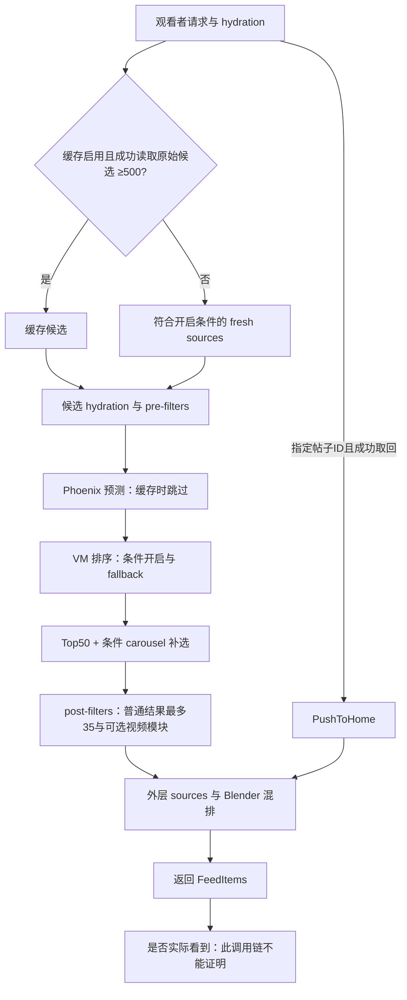

# 一条原创怎样进入某个人的 For You

审计日期：2026-10-09。固定官方提交 `35650fb89f3b14dc6234312535f642779d891d88`。这是下面调用路径的核对，不是完整源码或线上部署审计；不替换旧版来源 manifest。

此前最重要的理解错误，是把作者的关注、点赞、评论当成目标观看者的推荐输入，再把评分权重当作扩大分发的开关。入口实际是 **某位观看者的一次请求**。先根据他的关注关系、行为历史、请求和缓存取候选，候选经筛选才取得对这个观看者的动作预测，然后排位、再次筛选、混排返回。权重不能给根本没进入候选池的帖子加分。低曝光只能说明少量被计数的观看，不能确定是没有召回、筛掉、预测差、排位低，还是返回后没看到。我们目前没有每位观看者的候选与排位日志，不能把某一层当成已确诊原因。

## 1. 输入属于谁

`get_for_you_feed` 把请求转换为 ForYou query；`QueryBuilder` 取 `viewer_id` 的资料。观看者明确不允许 ForYou 时，`in_network_only` 强制为真。feature switches 按观看者 ID、地区、语言、角色、客户端、产品等匹配，并允许覆盖；下文的默认值不是线上实际配置。请求还带已看/已服务 IDs、topic IDs、设备等。[home-mixer/server.rs:91](https://github.com/xai-org/x-algorithm/blob/35650fb89f3b14dc6234312535f642779d891d88/home-mixer/server.rs#L91-L163)；[home-mixer/server.rs:329](https://github.com/xai-org/x-algorithm/blob/35650fb89f3b14dc6234312535f642779d891d88/home-mixer/server.rs#L329-L360)。

ScoringSequence hydration 调用聚合服务时传的是 `query.user_id`，模型类型 Ranking；显式行为读取也是这个观看者，隐式行为读取他的展开图片、视频质量观看等。不是作者给别人点了几个赞就直接改所有陌生人的输入。[home-mixer/query_hydrators/scoring_sequence_query_hydrator.rs:32](https://github.com/xai-org/x-algorithm/blob/35650fb89f3b14dc6234312535f642779d891d88/home-mixer/query_hydrators/scoring_sequence_query_hydrator.rs#L32-L64)；[home-mixer/query_hydrators/explicit_engagement_signals_query_hydrator.rs:31](https://github.com/xai-org/x-algorithm/blob/35650fb89f3b14dc6234312535f642779d891d88/home-mixer/query_hydrators/explicit_engagement_signals_query_hydrator.rs#L31-L45)；[home-mixer/query_hydrators/implicit_engagement_signals_query_hydrator.rs:35](https://github.com/xai-org/x-algorithm/blob/35650fb89f3b14dc6234312535f642779d891d88/home-mixer/query_hydrators/implicit_engagement_signals_query_hydrator.rs#L35-L62)。

通用执行顺序是 query hydration → sources → candidate hydration → pre-filters → scorers → selector → post-hydration → post-filters → 截断 → finalize。query hydration 失败不更新对应字段；source 的 Err 不贡献候选，不等于整条请求必失败。[candidate-pipeline/candidate_pipeline.rs:123](https://github.com/xai-org/x-algorithm/blob/35650fb89f3b14dc6234312535f642779d891d88/candidate-pipeline/candidate_pipeline.rs#L123-L173)；[candidate-pipeline/candidate_pipeline.rs:234](https://github.com/xai-org/x-algorithm/blob/35650fb89f3b14dc6234312535f642779d891d88/candidate-pipeline/candidate_pipeline.rs#L234-L251)；[candidate-pipeline/candidate_pipeline.rs:286](https://github.com/xai-org/x-algorithm/blob/35650fb89f3b14dc6234312535f642779d891d88/candidate-pipeline/candidate_pipeline.rs#L286-L302)。

## 2. 候选源不保证每条新帖都获得试投

内层注册九个源；**所有八个 fresh sources 都要求没有有效缓存标志**。[home-mixer/candidate_pipeline/phoenix_candidate_pipeline.rs:354](https://github.com/xai-org/x-algorithm/blob/35650fb89f3b14dc6234312535f642779d891d88/home-mixer/candidate_pipeline/phoenix_candidate_pipeline.rs#L354-L363)。

| 源 | 实际进入条件与候选来源 |
|---|---|
| Thunder | 无缓存；传观看者的关注列表、已看排除项给 in-network 服务。CAPI 有客户端且 decider 开启才走，否则用配置集群 RPC。[home-mixer/sources/thunder_source.rs:25](https://github.com/xai-org/x-algorithm/blob/35650fb89f3b14dc6234312535f642779d891d88/home-mixer/sources/thunder_source.rs#L25-L70) |
| PopularPosts | 无缓存、允许圈外、source switch 默认 true；读取热门池，空池直接零候选，剔除观看者已看 IDs。[home-mixer/sources/popular_posts_source.rs:27](https://github.com/xai-org/x-algorithm/blob/35650fb89f3b14dc6234312535f642779d891d88/home-mixer/sources/popular_posts_source.rs#L27-L54)；[home-mixer/params/param.rs:944](https://github.com/xai-org/x-algorithm/blob/35650fb89f3b14dc6234312535f642779d891d88/home-mixer/params/param.rs#L944-L953) |
| TweetMixer | 无缓存、允许圈外、source switch 默认 false。[home-mixer/sources/tweet_mixer_source.rs:23](https://github.com/xai-org/x-algorithm/blob/35650fb89f3b14dc6234312535f642779d891d88/home-mixer/sources/tweet_mixer_source.rs#L23-L31)；[home-mixer/params/param.rs:48](https://github.com/xai-org/x-algorithm/blob/35650fb89f3b14dc6234312535f642779d891d88/home-mixer/params/param.rs#L48-L52) |
| SimClusters | 无缓存、允许圈外、switch 默认 true，且观看者有 post signals；没有合格种子返回空。[home-mixer/sources/simclusters_source.rs:215](https://github.com/xai-org/x-algorithm/blob/35650fb89f3b14dc6234312535f642779d891d88/home-mixer/sources/simclusters_source.rs#L215-L230)；[home-mixer/params/param.rs:55](https://github.com/xai-org/x-algorithm/blob/35650fb89f3b14dc6234312535f642779d891d88/home-mixer/params/param.rs#L55-L59) |
| Phoenix | 无缓存、允许圈外、switch 默认 true、普通或 bulk-topic 请求；缺 retrieval sequence 返回 Err。调用 retrieval RPC，公开默认 max results 1000，经 quality factor 调整。[home-mixer/sources/phoenix_source.rs:98](https://github.com/xai-org/x-algorithm/blob/35650fb89f3b14dc6234312535f642779d891d88/home-mixer/sources/phoenix_source.rs#L98-L128)；[home-mixer/params/param.rs:4](https://github.com/xai-org/x-algorithm/blob/35650fb89f3b14dc6234312535f642779d891d88/home-mixer/params/param.rs#L4-L15) |
| PhoenixTopics | 无缓存、允许圈外、topic 且非 bulk；缺 sequence 返回 Err。这里没有 `EnablePhoenixSource` 条件；不是帖子有 hashtag 就自动走此源。[home-mixer/sources/phoenix_topics_source.rs:26](https://github.com/xai-org/x-algorithm/blob/35650fb89f3b14dc6234312535f642779d891d88/home-mixer/sources/phoenix_topics_source.rs#L26-L59) |
| PhoenixMOE | 无缓存、允许圈外、普通或 bulk-topic、switch 默认 false；Sid 开关为 true 即排斥此源，不要求 Sid 实际运行；Sid 因 topic 或无 post signals 未启用时，两者都可能不贡献候选。另有 kill switch。[home-mixer/sources/phoenix_moe_source.rs:25](https://github.com/xai-org/x-algorithm/blob/35650fb89f3b14dc6234312535f642779d891d88/home-mixer/sources/phoenix_moe_source.rs#L25-L43)；[home-mixer/params/param.rs:171](https://github.com/xai-org/x-algorithm/blob/35650fb89f3b14dc6234312535f642779d891d88/home-mixer/params/param.rs#L171-L175) |
| Sid | 无缓存、允许圈外、非 topic、switch 默认 false、观看者有 post signals；按种子向服务召回。[home-mixer/sources/sid_source.rs:46](https://github.com/xai-org/x-algorithm/blob/35650fb89f3b14dc6234312535f642779d891d88/home-mixer/sources/sid_source.rs#L46-L86)；[home-mixer/params/param.rs:629](https://github.com/xai-org/x-algorithm/blob/35650fb89f3b14dc6234312535f642779d891d88/home-mixer/params/param.rs#L629-L633) |
| CachedPosts | 仅 `has_cached_posts` 为真才返回 query 中缓存候选。[home-mixer/sources/cached_posts_source.rs:10](https://github.com/xai-org/x-algorithm/blob/35650fb89f3b14dc6234312535f642779d891d88/home-mixer/sources/cached_posts_source.rs#L10-L15) |

缓存标志要求 `EnableCachedPosts` 开启（公开默认 true）、读取成功、解压/解析成功且候选数 **≥500**。500 是反序列化缓存 Vec 的原始条数，不是500条已通过筛选的候选。小于500不设标志，不能把每个 cache hit 都当成 fresh 关闭。后续 filters 可能大量删除，执行器不会因此自动重跑 fresh sources 补足，只截断剩余结果。[执行器:147](https://github.com/xai-org/x-algorithm/blob/35650fb89f3b14dc6234312535f642779d891d88/candidate-pipeline/candidate_pipeline.rs#L147-L153)。[home-mixer/query_hydrators/cached_posts_query_hydrator.rs:11](https://github.com/xai-org/x-algorithm/blob/35650fb89f3b14dc6234312535f642779d891d88/home-mixer/query_hydrators/cached_posts_query_hydrator.rs#L11-L80)；[home-mixer/params/param.rs:559](https://github.com/xai-org/x-algorithm/blob/35650fb89f3b14dc6234312535f642779d891d88/home-mixer/params/param.rs#L559-L563)。热门池初始化同样不能省略：Manhattan store 初始化失败改用默认空的内存 store；refresh 异步启动后立即读当前 snapshot，首个请求不保证已有热门候选。[home-mixer/candidate_pipeline/phoenix_candidate_pipeline.rs:896](https://github.com/xai-org/x-algorithm/blob/35650fb89f3b14dc6234312535f642779d891d88/home-mixer/candidate_pipeline/phoenix_candidate_pipeline.rs#L896-L904)；[home-mixer/util/popular_posts.rs:145](https://github.com/xai-org/x-algorithm/blob/35650fb89f3b14dc6234312535f642779d891d88/home-mixer/util/popular_posts.rs#L145-L243)。

**一个精确的“没进池”例子：** 某次请求成功加载≥500条缓存，目标新原创不在这些缓存候选里；八个 fresh sources 关闭，CachedPosts 只复制现有缓存，这条原创就没有进入这一请求的内层有机候选池，也不会得到该次 Phoenix 预测。另一种情形是该观看者 `in_network_only=true`、没有缓存，目标原创不在 Thunder 实际返回结果中：其余圈外源全关闭，也不会进这个池。不能单凭“未关注作者”断言 Thunder 永远无该内容，关注关系里的转发等也可能改变来源结果。

此例**不是整个 ForYou 的无条件结论**：外层另有 PushToHome，请求指定 post ID 且 TES 成功可单独产生 FeedItem，绕过内层路径。[home-mixer/server.rs:121](https://github.com/xai-org/x-algorithm/blob/35650fb89f3b14dc6234312535f642779d891d88/home-mixer/server.rs#L121-L157)；[home-mixer/sources/push_to_home_source.rs:18](https://github.com/xai-org/x-algorithm/blob/35650fb89f3b14dc6234312535f642779d891d88/home-mixer/sources/push_to_home_source.rs#L18-L65)。

## 3. 进入池后，预测和筛选仍是两回事

pre-filters 在评分前执行，含重复、数据/年龄、自己、圈外回复转发、已看/已服务、屏蔽静音、topic 等；不是所有取回帖都进入模型。[home-mixer/candidate_pipeline/phoenix_candidate_pipeline.rs:395](https://github.com/xai-org/x-algorithm/blob/35650fb89f3b14dc6234312535f642779d891d88/home-mixer/candidate_pipeline/phoenix_candidate_pipeline.rs#L395-L424)。具体地，OON retweet 移除；OON reply 仅在开关允许且属于规定 Phoenix home retrieval 路径时保留，reply 缺 ancestors 仍移除。这不代表 X 的所有回复入口都不展示回复。[home-mixer/filters/oon_retweet_reply_filter.rs:15](https://github.com/xai-org/x-algorithm/blob/35650fb89f3b14dc6234312535f642779d891d88/home-mixer/filters/oon_retweet_reply_filter.rs#L15-L24)。

评分顺序是 PhoenixScorer → VMRanker。Phoenix 的请求包含候选原帖信息、观看者 scoring sequence、语言地区等 context、surface、reranker head tag；候选的 followed 标志也来自观看者关注列表。[home-mixer/candidate_pipeline/phoenix_candidate_pipeline.rs:455](https://github.com/xai-org/x-algorithm/blob/35650fb89f3b14dc6234312535f642779d891d88/home-mixer/candidate_pipeline/phoenix_candidate_pipeline.rs#L455-L458)；[home-mixer/util/phoenix_request.rs:157](https://github.com/xai-org/x-algorithm/blob/35650fb89f3b14dc6234312535f642779d891d88/home-mixer/util/phoenix_request.rs#L157-L225)。PhoenixScorer 从响应按原帖 ID 取得预测 heads、backbone 与可选 home-excursion heads；缓存标志会跳过此 scorer，缺 scoring sequence 回默认评分对象，RPC 失败回 Err，通用 scorer 对 Err 保留已有候选状态而非删除。[home-mixer/scorers/phoenix_scorer.rs:68](https://github.com/xai-org/x-algorithm/blob/35650fb89f3b14dc6234312535f642779d891d88/home-mixer/scorers/phoenix_scorer.rs#L68-L124)；[candidate-pipeline/scorer.rs:52](https://github.com/xai-org/x-algorithm/blob/35650fb89f3b14dc6234312535f642779d891d88/candidate-pipeline/scorer.rs#L52-L57)。

公开 Python ranker `RecsysAggregatedModel.forward` 由 batch 和 embeddings 建输入，输出 candidate logits 与 continuous predictions；runner 对 logits 取 `log_sigmoid`。这是真实公开模型接口，但不能证明线上这次请求用了哪个 checkpoint、训练数据或校准映射。Rust prediction/egress 客户端来自这里没有实现的 `component_library`，不能凭调用名补出完整生产转换。[phoenix/xrex/models/recsys_model.py:4272](https://github.com/xai-org/x-algorithm/blob/35650fb89f3b14dc6234312535f642779d891d88/phoenix/xrex/models/recsys_model.py#L4272-L4372)；[phoenix/xrex/inference/model_runner.py:4355](https://github.com/xai-org/x-algorithm/blob/35650fb89f3b14dc6234312535f642779d891d88/phoenix/xrex/inference/model_runner.py#L4355-L4393)；[home-mixer/util/egress.rs:1](https://github.com/xai-org/x-algorithm/blob/35650fb89f3b14dc6234312535f642779d891d88/home-mixer/util/egress.rs#L1-L3)。

价值权重作用于 **预测 heads**，含正、负动作及 continuous 值，不是已收到互动数乘权重。[home-mixer/scorers/value_model.rs:8](https://github.com/xai-org/x-algorithm/blob/35650fb89f3b14dc6234312535f642779d891d88/home-mixer/scorers/value_model.rs#L8-L49)；[xai-value-model/scoring.rs:92](https://github.com/xai-org/x-algorithm/blob/35650fb89f3b14dc6234312535f642779d891d88/xai-value-model/scoring.rs#L92-L135)。实际计数仍可能经别的路径起作用，例如热门池和作者 cold-start；不能反过来说所有实际互动都无关。

同文件维护者注释还特别区分 Home 内的行为与直接打开帖子链接的行为，说明不能把直接访问产生的互动当成 Home 排序输入。[xai-value-model/scoring.rs:32](https://github.com/xai-org/x-algorithm/blob/35650fb89f3b14dc6234312535f642779d891d88/xai-value-model/scoring.rs#L32-L56)。这是公开注释给出的口径，本次没有核实完整客户端采集与生产训练链。X 与 GitHub 互链可以带来直接访问、使用或关注，但这些结果不能自动证明 Home 推荐信号增强，更不能由链接热度推出指数增长。

缓存不是整套 ranking 关闭：VMRanker 仍由 `EnableRanking` 控制，默认 true；本地复用 cached weighted score 或重新计算，再执行 cold-start；RPC 成功可覆盖返回 score，失败或漏候选保留本地结果。[home-mixer/params/param.rs:270](https://github.com/xai-org/x-algorithm/blob/35650fb89f3b14dc6234312535f642779d891d88/home-mixer/params/param.rs#L270)；[home-mixer/scorers/vm_ranker.rs:59](https://github.com/xai-org/x-algorithm/blob/35650fb89f3b14dc6234312535f642779d891d88/home-mixer/scorers/vm_ranker.rs#L59-L129)。DPP 需要进程启动建立 context **且** request feature 允许；CLI 默认 false，feature 默认 true，没有启动 context 时请求 `value_model_id="dpp"` 也不会启动 DPP。[vm-ranker/args.rs:15](https://github.com/xai-org/x-algorithm/blob/35650fb89f3b14dc6234312535f642779d891d88/vm-ranker/args.rs#L15-L19)；[vm-ranker/main.rs:29](https://github.com/xai-org/x-algorithm/blob/35650fb89f3b14dc6234312535f642779d891d88/vm-ranker/main.rs#L29-L49)；[vm-ranker/params.rs:229](https://github.com/xai-org/x-algorithm/blob/35650fb89f3b14dc6234312535f642779d891d88/vm-ranker/params.rs#L229-L234)；[vm-ranker/scoring/mod.rs:31](https://github.com/xai-org/x-algorithm/blob/35650fb89f3b14dc6234312535f642779d891d88/vm-ranker/scoring/mod.rs#L31-L89)。线上这两道门是否打开未知。

## 4. 排位、返回、实际观看

TopK selector 按最终 `candidate.score` 排序先取50；carousel 条件满足时再从未选候选加视频，不能说 post-filter 永远只收到50条。之后 VF/AncillaryVF/会话去重/carousel filter，普通帖子结果最多35；视频候选还可能单独构成 carousel 模块，再由外层作为一个 FeedItem 接收。[home-mixer/selectors/top_k_score_selector.rs:10](https://github.com/xai-org/x-algorithm/blob/35650fb89f3b14dc6234312535f642779d891d88/home-mixer/selectors/top_k_score_selector.rs#L10-L35)；[home-mixer/params/config.rs:17](https://github.com/xai-org/x-algorithm/blob/35650fb89f3b14dc6234312535f642779d891d88/home-mixer/params/config.rs#L17-L23)；[home-mixer/candidate_pipeline/phoenix_candidate_pipeline.rs:482](https://github.com/xai-org/x-algorithm/blob/35650fb89f3b14dc6234312535f642779d891d88/home-mixer/candidate_pipeline/phoenix_candidate_pipeline.rs#L482-L487)；[home-mixer/candidate_pipeline/phoenix_candidate_pipeline.rs:1100](https://github.com/xai-org/x-algorithm/blob/35650fb89f3b14dc6234312535f642779d891d88/home-mixer/candidate_pipeline/phoenix_candidate_pipeline.rs#L1100-L1102)。

外层再取 ScoredPosts、广告、WhoToFollow、prompts、PushToHome、Jetfuel、survey 并 Blender 混排，随后过滤并按外层上限返回 FeedItems；不是把 Phoenix score 原样当完整首页。[home-mixer/candidate_pipeline/for_you_candidate_pipeline.rs:199](https://github.com/xai-org/x-algorithm/blob/35650fb89f3b14dc6234312535f642779d891d88/home-mixer/candidate_pipeline/for_you_candidate_pipeline.rs#L199-L240)；[home-mixer/for_you_server.rs:30](https://github.com/xai-org/x-algorithm/blob/35650fb89f3b14dc6234312535f642779d891d88/home-mixer/for_you_server.rs#L30-L49)。

ScoredPostsSource 将普通帖子与可选 carousel 模块分别转为 FeedItem；普通帖子上限不包括模块中的视频数。[home-mixer/sources/scored_posts_source.rs:21](https://github.com/xai-org/x-algorithm/blob/35650fb89f3b14dc6234312535f642779d891d88/home-mixer/sources/scored_posts_source.rs#L21-L30)。

| 我们可看到的代理 | 不能从它反推的实际状态 |
|---|---|
| public views 与 owner impressions 分开记录；60m/24h未测窗口保留未知；detail/profile 点击 | 哪些观看者召回了它、源贡献、filter 原因、候选竞争分位、返回后是否滚到 |
| 外部真人回复/独立转发、可辨认的新关注与蓝V质量 | 全部观看者行为序列、模型隐藏概率、线上 checkpoint/feature switches；相关不等于导致后续召回 |
| 已公布入口与默认参数 | 该账号每次请求的实际参数、缓存 key 命中、预测或 VM RPC trace |

源码有 debug JSON 的 query/retrieved/filtered/selected 信息，也有 gated under-the-hood tracing；正常公开帖计数不是这些日志。[home-mixer/scored_posts_server.rs:153](https://github.com/xai-org/x-algorithm/blob/35650fb89f3b14dc6234312535f642779d891d88/home-mixer/scored_posts_server.rs#L153-L167)；[home-mixer/server.rs:162](https://github.com/xai-org/x-algorithm/blob/35650fb89f3b14dc6234312535f642779d891d88/home-mixer/server.rs#L162-L163)；[home-mixer/params/param.rs:565](https://github.com/xai-org/x-algorithm/blob/35650fb89f3b14dc6234312535f642779d891d88/home-mixer/params/param.rs#L565-L569)。没有日志时诊断只能保留多个解释。

为了明确诊断对象，可用统计学的条件概率链表示某次观看者请求 r 的 Home 实际观看概率：`P(R|r) × P(F|R,r) × P(S|F,R,r) × P(V|S,F,R,r)`。R 是帖子进入该请求任一路径候选（包括缓存与外层支路）；F 是通过相关路径过滤；S 是最终被返回；V 是实际观看。**这是我们的诊断表达，不是 X 官方打分公式，也不假设四项独立。** 公开 views、owner impressions 和认证 Home 计数各有口径，不能用一个累计数反解这些条件概率；当前数据不足以估计哪一项低。

## 5. 两个从召回路径导出的可测假说

这是 RISE 的假说，**不是代码保证**。SimClusters 合并观看者显式/隐式 post signals，按互动信号时间排序，并按帖子 ID 去重种子，再向 ANN 取候选。[home-mixer/sources/simclusters_source.rs:215](https://github.com/xai-org/x-algorithm/blob/35650fb89f3b14dc6234312535f642779d891d88/home-mixer/sources/simclusters_source.rs#L215-L243)；[home-mixer/sources/simclusters_source.rs:287](https://github.com/xai-org/x-algorithm/blob/35650fb89f3b14dc6234312535f642779d891d88/home-mixer/sources/simclusters_source.rs#L287-L309)。因此应先找正在真实讨论同一个具体技术问题的人：例如 agent 任务重试后文件排序错乱，给可运行最小示例解决他正在问的问题，再把完整可复用解法做原创。观察当事人是否实质回复、使用或独立转发，以及原创60m/24h曝光与点击，而不是用自己点赞当成目标观看者 seed。即使收到反馈，也没有证据证明此帖进入相关人的 SimClusters 候选。

Thunder 使用观看者的关注列表，所以另一条假说是先解决某位相关开发者的真实问题，争取对方因价值自愿关注或分享，使以后原创有机会进入其关系网络候选。测量实质反馈/自愿新关注与后续原创窗口，不把单向关注他理解成他会收到我们的帖，也不把同意交流等同于首页曝光。两条都需要真实需求与反馈，不刷互动或制造热度；本文件没有“天量流量”的必然机制。
